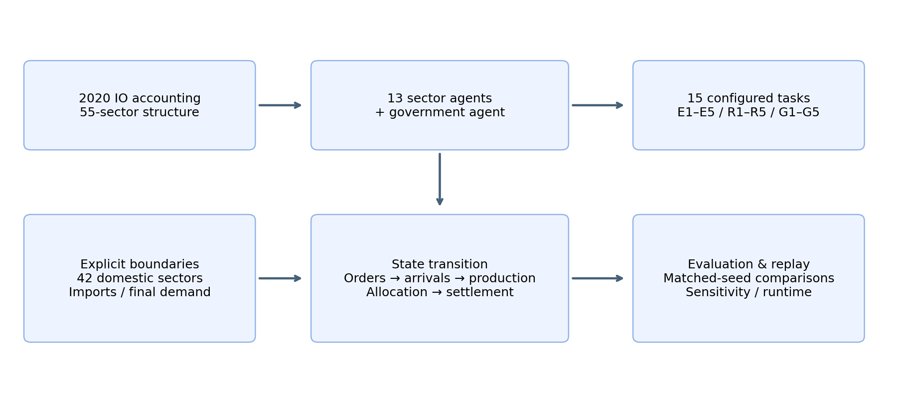

# IC-EconGym

**An Input–Output-Constrained Multi-Agent Testbed for Semiconductor Industrial Policy and Supply-Chain Resilience**

[中文说明](README_zh.md) · [Chinese manuscript](paper/manuscript_zh.md) · [Project Page](https://jinhua188.github.io/IC-EconGym/) · [Tasks](TASKS.md) · [Mechanisms](MECHANISMS.md) · [Data Card](DATA_CARD.md) · [Reproducibility](REPRODUCIBILITY.md) · [Contributing](CONTRIBUTING.md)

> **Research prototype.** IC-EconGym is designed for conditional mechanism experiments and benchmark comparisons. It is **not** a calibrated digital twin or a real-world policy forecasting system. Model-internal effects must not be interpreted as causal effects in the real semiconductor industry without additional identification and external validation.

## What is IC-EconGym?

IC-EconGym is a Python research environment with **13 industrial-sector agents + 1 government agent**, **15 configured tasks**, and **3 accounting-consistent import-allocation assumptions**. Orders, source-specific materials, inventory, capacity, rationing, project delays and fiscal spending are executed under a common input–output accounting boundary.

The current benchmark covers three question families:

- **E1–E5 · AI empowerment:** when capability changes translate into delivery;
- **R1–R5 · AI and supply-chain risk:** how local responses propagate through production constraints;
- **G1–G5 · AI governance and industrial policy:** how fixed fiscal resources are allocated across sectors and instruments.

## Current evidence — v0.3.0 release preparation

**Release status:** `VERSION=0.3.0` identifies the pending release line. No `v0.3.0` tag, GitHub Release or DOI has been published. The existing [v0.2.0 release](https://github.com/Jinhua188/IC-EconGym/releases/tag/v0.2.0) remains the published baseline. See [release readiness](RELEASE_READINESS.json).

The v0.3 line adds learning, robustness and validation-oriented experiments while retaining unsuccessful or inconclusive results:

- task activation and constraint-binding diagnostics;
- R1 sector IPPO and G5 government PPO with independent training instances and locked test sets;
- joint parameter, import-structure and alternative-rationing evaluation;
- a local manufacturing-capacity external-validation case;
- fixed-agent runtime and batch-throughput measurements.

R1 IPPO performs worse than the rule baseline on final-demand delivery despite rising training reward. G5 PPO improvements are not separated from zero under the reported uncertainty intervals. The local capacity queue is worse than a linear trend on the holdout period. These results are retained in [EXPERIMENT_UPGRADE.md](EXPERIMENT_UPGRADE.md) and the [manuscript](paper/manuscript_zh.md).

Important boundaries remain: many dynamic coefficients are scenario settings; supplier-choice channels are synthetic; candidate firm links are not observed transaction weights; LLM agents and nationwide dynamic calibration are not part of the current benchmark.

## Quick start

```bash
python -m pip install -r requirements_ic.txt
python validate_extension.py
python -m ic_extension.entrypoint --problem_scene ic_e1 --ic_periods 30
python -m scripts_ic.run_all_tasks --out demo_results_v2 --seeds 1,2,3 --arms v1
```

To view the static project interfaces locally:

```bash
python -m http.server 8000
```

Then open `http://localhost:8000/docs/`. The web demo replays precomputed trajectories; changing selectors in the browser does not run a new simulation.

## Accounting boundary



The 2020 accounting table was split from 42 to 55 sectors using revenue shares. Thirteen related sectors are decision agents; the other 42 domestic sectors, imports and final demand remain explicit boundaries. Monetary flows use fixed-base ten-thousand CNY units, with annual baseline flows divided into four equal quarters.

## Architecture and repository map

| Path | Purpose |
|---|---|
| `ic_extension/` | Environment, role constraints, policies and World13 adapter |
| `cfg_ic/` | E1–E5 empowerment, R1–R5 risk, G1–G5 governance tasks |
| `scripts_ic/` | Task runners, benchmarks, diagnostics and runtime tools |
| `benchmark_results/` | Paired results, learning evaluations and statistical summaries |
| `benchmark_splits/` | Locked train/validation/test scenario definitions |
| `calibration/` | Parameter registry, data-source registry and proxy mappings |
| `external_validation/` | Local external-validation evidence and source manifest |
| `learning/` | Learning policies, checkpoints and training utilities |
| `robustness/` | Joint parameter and structural robustness experiments |
| `paper/` | Manuscript, figures and computed summaries |
| `docs/` | GitHub Pages project site, task replay and observer |

## Evaluation principle

IC-EconGym separates **policy-generated internal orders** from **common exogenous final demand**. Strategy comparison therefore reports final-demand delivery independently of the amount of internal demand a policy creates. Reward, fixed-price value added, final-demand fill rate, shortages, private spending, fiscal spending and binding constraints are reported as distinct objects.

A change in an internal state is not automatically evidence of improved system performance. A model-internal improvement is not automatically evidence of a real-world causal policy effect.

## Learning and verification

Use a separate Python 3.12 environment for learning. Original quick-start commands continue to execute the original engine. The v0.3 adapter is explicit:

```bash
python -m pip install -r requirements_learning.lock.txt
python -m scripts_ic.verify_upgrade
python -m ic_extension.entrypoint_v3 --problem_scene ic_r1 --split test_id --scenario 0 --sector-policy learned
python -m ic_extension.entrypoint_v3 --problem_scene ic_g5 --split test_ood --scenario 0 --government-policy learned
```

The independent training instances, locked ID/OOD scenarios, joint robustness and timing commands are documented in [EXPERIMENT_UPGRADE.md](EXPERIMENT_UPGRADE.md). Reusing the original EconGym household/bank policies as sector baselines requires a separate adaptation.

Governance checks do not retrain policies:

```bash
python -m pip install -r requirements_governance.txt
python -m scripts_ic.check_governance
python -m scripts_ic.check_governance --publication
```

The last command intentionally fails while release confirmations are pending. See [PUBLISHING.md](PUBLISHING.md).

## Contributing

External contributors use forks and Pull Requests. The main-branch and tag rules are recorded in [GITHUB_SETTINGS_CHECKLIST.md](GITHUB_SETTINGS_CHECKLIST.md); verify their live status in repository Settings. The preferred workflow is:

1. open an Issue describing the bug, research question, task proposal or validation evidence;
2. fork the repository and create a focused branch;
3. add tests, evidence boundaries and reproduction commands;
4. open a Pull Request;
5. maintainers review and decide whether to merge.

See [CONTRIBUTING.md](CONTRIBUTING.md) and [GOVERNANCE.md](GOVERNANCE.md).

We particularly welcome contributions that add:

- new benchmark tasks with a clearly stated economic mechanism;
- rule, optimization, MARL or LLM-agent baselines under the same observation/action/resource constraints;
- tests that reveal non-binding or mis-specified mechanisms;
- externally auditable data mappings or validation cases;
- reproducibility, performance and documentation improvements.

## Citation

GitHub will expose a **Cite this repository** panel from [`CITATION.cff`](CITATION.cff).

Software citation author: **Jinhua Gu**, Guangdong University of Technology, [ORCID 0009-0002-2310-6150](https://orcid.org/0009-0002-2310-6150), as supplied by the owner. See [AUTHOR_METADATA.md](AUTHOR_METADATA.md). After Zenodo archives the release, add its actual DOI to `CITATION.cff` and this README.

**DOI:** pending first Zenodo archive of v0.3.0. Until a release exists, cite the exact commit used rather than describing v0.3.0 as a published release.

## License and data rights

Project-authored source code and explicitly listed operational documentation are released under the **Apache License 2.0** unless a file states otherwise. See [`LICENSE`](LICENSE), [`LICENSE_SCOPE.md`](LICENSE_SCOPE.md) and [`THIRD_PARTY_NOTICES.md`](THIRD_PARTY_NOTICES.md).

The Apache-2.0 grant does **not** automatically relicense third-party materials, restricted source data, public disclosures, or materials for which the project does not own redistribution rights. Processed matrices, proxy tables, trained checkpoints, simulation outputs and the manuscript are separately listed in [RIGHTS_REGISTRY.csv](RIGHTS_REGISTRY.csv). No dataset or manuscript license is inferred from the source-code license. Public-data redistribution review remains a release gate.

## Versioning and releases

- `v0.x`: research-prototype releases; APIs and task definitions may still change.
- patch releases: metadata, documentation and compatible bug fixes;
- minor releases: new tasks, algorithms, evaluation protocols or material behavior changes;
- `v1.0`: reserved for a substantially stabilized benchmark with documented external validation and governance.

See [CHANGELOG.md](CHANGELOG.md), [ROADMAP.md](ROADMAP.md) and the draft [v0.3.0 release notes](RELEASE_v0.3.0.md).

## References and attribution

- [EconGym](https://github.com/Miracle1207/EconGym): task-oriented economic benchmarking.
- [WonderEcon](https://github.com/Planet-300894/WonderEcon): economic trajectory observation and interaction.

Upstream repositories are obtained separately and are not included in this repository. Source-specific attribution is recorded in [THIRD_PARTY_NOTICES.md](THIRD_PARTY_NOTICES.md).

## Maintainer

Repository owner and final merge authority: **@Jinhua188**.

For scientific disagreements, please open a Research Question / Mechanism Issue rather than treating model assumptions as bugs by default.
