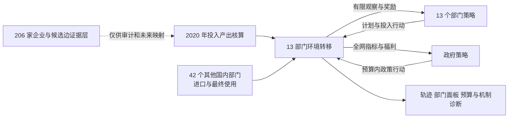
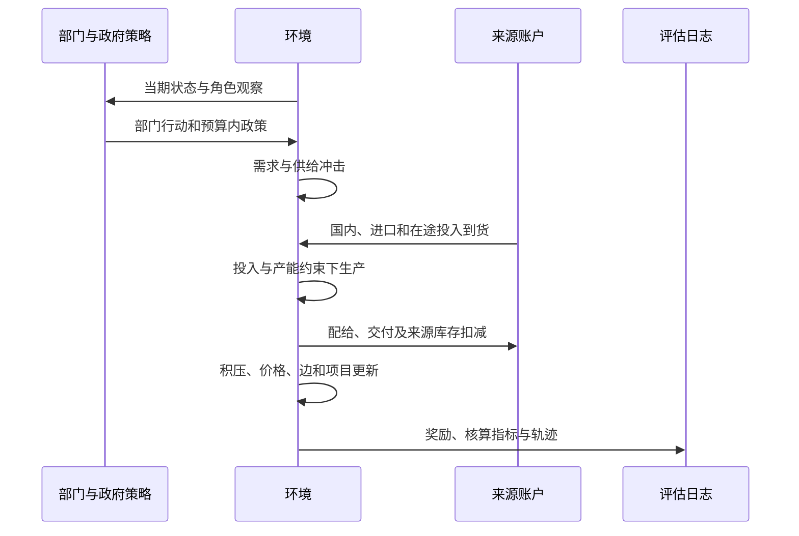

# IC-EconGym: An Input–Output-Constrained Multi-Agent Testbed for Semiconductor Industrial Policy and Supply-Chain Resilience

**中文题名：** IC-EconGym：投入产出约束下的集成电路产业政策与供应链韧性多智能体测试平台  
**稿件性质：** 中文方法与实验完善稿，含公开复现接口与最终需求履约指标，供后续英文投稿稿改写。以下结果截至 2026 年 10 月 3 日；未完成的实验在正文中明确标出。

## 摘要

通用经济多智能体环境为算法训练与政策模拟提供了统一接口，但产业场景中的投入依赖、来源区分、交付时滞和财政约束需要更细的状态转移。本文提出 IC-EconGym，一个以 2020 年投入产出核算为锚的集成电路产业测试平台。平台以 13 个相关产业部门和 1 个政府部门为决策主体，将其余 42 个国内部门、进口来源及最终使用保留为显式边界；固定投入系数约束订单和生产，库存、积压、产能项目、供应边状态和政府预算决定跨期响应。统一观察—行动—转移接口支持赋能、风险和治理三组共 15 项条件机制任务。现有代码通过三种进口分配假设下的基期核算检查，并完成两组配对策略比较：在 R1 需求冲击任务中，既定规则在共同外生最终需求下的履约率高于两种需求响应启发式；在 G5 多工具治理任务中，同预算短缺靶向策略的改变量较小。参数和进口分配敏感性实验显示上述结果依赖具体模型设定。另对 15 个任务测量了固定 13 部门环境的运行时间。当前平台尚无学习型策略比较、同口径独立外部数据验证或企业级交易流识别，因此本文的实证结论限于可复现的核算约束环境和条件策略实验。

**关键词：** 多智能体经济环境；投入产出表；集成电路产业；供应链韧性；产业政策；基准测试

## 1 Introduction

经济环境只有允许主体行动改变下一期可行资源，才能用于检验动态决策。通用平台 EconGym 将家庭、企业、银行与政府建模为可组合的角色，并通过观察、行动和奖励接口比较经济规则、强化学习及语言模型策略；其论文还分别考察了算法表现、与外部数据的贴合及运行效率（[Mi et al., 2025](https://proceedings.nips.cc/paper_files/paper/2025/hash/40d45b1e23d00d5895e65778e85cf8ee-Abstract-Datasets_and_Benchmarks_Track.html)）。集成电路产业提出另一组约束：一个部门的生产计划会形成对多个上游部门的投入需求，供给需要经过交付与认证，扩产不能在投资当期全部兑现，政策资金也必须落到具体的能力或交付环节。这些约束使局部生产率改善与系统交付改善可能分离。

生产网络研究已经说明，企业间投入关系会改变冲击传播的范围；基于日本企业供应链的仿真也展示了网络结构在停工冲击中的作用（[Inoue and Todo, 2020](https://arxiv.org/abs/2003.14002)）。但“知道网络可能传播冲击”并不等于拥有一个供产业智能体反复决策、结算和评估的标准环境。对于中国集成电路产业，还必须区分统计表所记录的部门投入、公开资料可支持的商业关系，以及仅在技术上可能成立的候选企业关系。若把候选边直接当作已观测采购额，模拟可能在进入行为比较前就改变了资源约束。

本文构建 IC-EconGym，使 13 个相关部门和 1 个政府智能体在共同的投入产出边界内运行。部门在有限观察下提出生产、投资、研发、AI、协同等行动；政府在有限总预算下选择支出渠道和部门靶向。环境按照固定投入技术、分来源到货、产能、配给和动态状态更新执行行动。其研究用途是比较：当相同冲击和资源约束施加到不同策略时，累计短缺、增加值、服务率和财政支出如何变化。

平台围绕三个可证伪问题组织任务：**RQ1**，在投入或产能约束绑定时，AI 与预测能力的改善能否转化为实际交付；**RQ2**，相同的局部决策规则在共同误判、拥堵和交付时滞下是否放大系统损失；**RQ3**，给定相同预算和可见信息，政府靶向规则的排序是否随进口分配与动态参数改变。当前 R1 与 G5 实验只回答 RQ2、RQ3 中的特定条件比较，RQ1 仍需更有针对性的机制消融与外部行为证据。

本文目前可核查的贡献有三项。第一，平台把经平衡的部门用途表转为逐期订单和生产约束，保留其他国内部门与进口边界。第二，同一环境承载赋能、风险和治理三类 15 项任务，角色接口与情景配置分离。第三，提供同冲击配对比较、进口分配敏感性、单因素扰动和固定规模运行测量。本文不把尚未实现的学习策略、企业网络重连和现实校正写成平台结果；它们构成后续基准版本需要通过的验证门槛。

## 2 Related Work and Positioning

### 2.1 通用经济多智能体基准

EconGym 的贡献是把多种经济角色、任务和算法放入统一测试环境，并用养老金政策、多政府协同及效率实验说明平台用途（[Mi et al., 2025](https://proceedings.nips.cc/paper_files/paper/2025/hash/40d45b1e23d00d5895e65778e85cf8ee-Abstract-Datasets_and_Benchmarks_Track.html)）。IC-EconGym 沿用其“角色接口—环境转移—任务配置—评估轨迹”的组织方式，研究对象则限定为投入依赖较强的产业部门。原 EconGym 面向家庭、金融和一般市场的已训练策略不能直接用于 13 部门的观察和行动空间；本稿已运行的算法比较只包括明确编码的规则与启发式，学习型基线仍需单独训练。

WonderEcon 的公开仓库展示观察界面和玩家接管，并说明观察、信念、价格及行动的语言模型决策流程（[项目仓库](https://github.com/Planet-300894/WonderEcon)）。其交互方式为本项目的轨迹浏览提供参考；论文中的算法比较仍需依据可执行策略、共同观察和动作约束建立，网页功能不能替代算法证据。

### 2.2 生产网络与部门核算

投入产出表给出部门产品的用途与来源，使生产约束能够保持总量一致。它不提供企业间真实交易、交付条件或行为参数。企业级供应链研究通常需要实际供应关系及更细的产品信息；部门级环境则以核算一致性和可控的情景实验为主要优势。本文在这两个层级之间设置证据边界：企业候选关系可以为未来网络扩展提供支持集，却不能直接替代部门投入系数。

### 2.3 经济世界模型与本平台的能力边界

[Han et al.（2026）](https://arxiv.org/abs/2608.06020)提出经济世界模型的主体、环境、共同演化、现实对齐和分层评估框架。项目内部产业经济世界模型蓝图（项目内部资料，未随仓库发布）据此讨论企业状态、关键承接边和多时间尺度网络变化。IC-EconGym 目前实现的是其中的**部门级环境执行与轨迹评估**：规则策略根据观察选择行动，环境更新订单、生产、库存和政策状态。它尚未实现显式信念更新、学习中的策略适应、内生制度演化或在线现实数据校正。这样界定可使后续功能扩展与当前可复现实验保持一致。

**表 1｜系统定位与证据状态**

| 维度 | EconGym 论文 | 本文当前实现 | 待验证扩展 |
|---|---|---|---|
| 决策主体 | 多类家庭、企业、银行、政府 | 13 个部门、1 个政府 | 有业务份额约束的企业主体 |
| 生产结构 | 多种一般经济模型 | 2020 年投入产出系数及来源分账 | 企业产品流与部门总量一致的分解 |
| 算法 | 规则、学习、语言模型等 | 三种部门规则与三种政府靶向规则 | 统一约束下的 RL、LLM 与模仿学习 |
| 现实贴合 | 论文包含外部数据比较 | 核算和内部状态检查 | 独立同口径观测与历史回放 |
| 效率 | 报告主体规模实验 | 固定 13 部门、15 任务的每步时间 | 经验证的企业级规模扩展 |

## 3 Data and Economic Boundary

### 3.1 投入产出核算

输入为工作区的 2020 年投入产出工作簿。预处理形成 55 部门表，其中前 13 个与研究场景相关，另外 42 个国内部门仍参与用途核算。55 部门中的细分项由原 42 部门按照营业收入比例分劈，因此细分部门用途结构不属于独立逐笔观测。年度金额单位为万元；模型将年度基期流量除以四，得到固定 2020 年价格的季度基准。记 $z^d_{rj}$ 和 $z^m_{rj}$ 分别为部门 (j) 使用产品 (r) 的国内和进口中间投入，$x_j$ 为年产出，则

\[
a^d_{rj}=z^d_{rj}/x_j,\qquad a^m_{rj}=z^m_{rj}/x_j.
\]

矩阵同时保留国内中间使用、进口中间使用、其他国内部门销售和最终使用。由于现有来源数据不能识别每一项进口产品的实际使用者，平台提供比例分配、优先中间使用、优先最终使用三种核算一致情景。三者是分配假设，不能解释为三套已观测供应链。年度投入产出预处理的最大行、列绝对平衡误差分别约为 $5.96\times10^{-6}$ 和 $7.39\times10^{-6}$ 万元；这些是数值核算检查，不是外部预测精度（[预处理核验](../ic_extension/data/io_preparation_audit.json)）。

### 3.2 企业资料的用途与限制

另有 206 家企业节点与 8,364 条候选关系，可描述设备、材料、设计、制造、封测与应用等机制角色。候选集合反映分类和兼容规则，缺少逐产品交易金额与完整关系时间戳。企业到 13 部门的 2020 年业务份额模板中，已识别份额为 0/206；H3、H4、H5 等角色与统计部门也并非一一对应（[源数据审计](../reference/iewm13_source_audit.json)）。因此，本文不把 8,364 条边载入部门生产方程，不把三个合成同类供给通道称为三家已观测企业。

**表 2｜参数与证据来源**

| 对象 | 当前来源 | 在模型中的作用 | 证据边界 |
|---|---|---|---|
| 部门基期产出、投入和增加值 | 2020 年投入产出工作簿及细分处理 | 固定投入系数与核算边界 | 细分比例并非独立交易观测 |
| 进口产品用途 | 三种平衡分配情景 | 进口投入约束 | 实际使用者未识别 |
| AI 吸收、预测误差、扩产效率、积压保留 | 任务配置 | 动态响应 | 情景参数，未由投入产出表估计 |
| 企业属性与候选关系 | 企业表与候选边表 | 未来企业层支持集、描述性审计 | 未分配成部门实际流量 |
| 政府福利权重 | 任务配置 | 策略奖励与结果排序 | 研究者指定，非经验社会福利估计 |


图 1 平台架构与核算边界。

## 4 IC-EconGym Environment

### 4.1 主体、观察与行动

13 个部门 $j=1,\ldots,13$ 是代表性决策主体，政府为第 14 个主体。每个部门只观察自身产出、产能、库存、积压、价格、AI 与技术状态、上游价格和健康度、需求以及剩余政策预算；政府观察全网部门指标与总预算。部门行动包含计划产出、库存目标、价格调整、资本投资、研发、AI 投入、协同和多元化，其中可用行动受角色表限定。政府行动为向 13 部门分配 AI、产能、研发、资格、库存及边修复六类资金。部门当期奖励为经营利润扣除私人投资、研发及 AI 支出后的现金流；政府奖励是配置文件指定的增加值、短缺、技术、服务、价格和财政成本加权函数。福利权重的经济含义随任务而变，不能直接与估计出的社会福利等同。

从系统接口看，主体策略是 $a_{j,t}=\pi_j(o_{j,t})$，环境执行 $s_{t+1}=T(s_t,a_{1:13,t},a_{g,t},u_t;A)$。这里 $A=(a^d,a^m)$ 是核算约束，$u_t$ 是明确设置的需求或供给冲击。当前部门规则可以对观察作反应，但规则系数在运行中固定；因此不把它表述为在线学习或显式信念更新。

### 4.2 订单、到货与生产

部门的计划产出生成国内和进口投入需求。对于 13 个内部部门间的国内订单，库存目标还会增加补库需求；已交付货物经在途队列于后续期到达。其他 42 个国内部门及进口来源单独记账，不被虚构为 13 部门企业边。设 $M^d_{rj,t}$ 和 $M^m_{rj,t}$ 为当期可用投入库存，$K^{eff}_{j,t}$ 为受冲击和机制参数调整后的有效产能，则实际产出满足

\[
q_{j,t}=\min\left\{\widehat q_{j,t}+B_{j,t-1},\; D_{j,t},\;K^{eff}_{j,t},\;
\min_{r:a^d_{rj}>0}\frac{M^d_{rj,t}}{a^d_{rj}},\;
\min_{r:a^m_{rj}>0}\frac{M^m_{rj,t}}{a^m_{rj}}\right\}.
\]

其中 $D_{j,t}$ 是当前销售请求，$B_{j,t-1}$ 为上期积压。环境先满足内部中间使用请求，再按比例将余额分配给其他部门、最终使用和既有积压；未满足订单按设定保留率进入下一期，未售出产出进入成品库存。该配给次序是明确的模型假设。AI 有效能力由采用存量、吸收能力、时间适配和组织摩擦共同确定，作用于有效产能、成本和研发效率；如果投入、需求或其他产能约束仍然绑定，AI 状态改善不会自动提高实际产出。

### 4.3 承接边与政策机制

平台以部门投入关系承载边压力、健康度和资格状态。订单错配、未满足交付及 AI 能力与下游吸收的差距可提高压力；协同与政府修复可降低压力。边健康度与资格共同影响后续可用交付。附件企业级蓝图还讨论关键承接边的专用性、认证时滞和企业执行概率，这些为部门机制提供设计原则，但企业级压力系数、采购流量和拓扑变化未直接移植到当前 13 部门环境。H1—H6 用作机制标签，不是六个新增智能体。

政府每期提出各渠道支出，环境将其限制在剩余实验预算内；产能支持经设定滞后进入未来产能，AI 与研发资金改变相应状态，库存资金从外部国内部门边界购买额外投入。附件蓝图强调政策必须通过可执行机制改变资源或边状态，不能直接在结果变量上加“政策收益”。本文遵循这一原则，并把政府支出及私人投入分别记录。

若 $g_{jk,t}$ 是政府在时期 (t) 对部门 (j)、渠道 (k) 的实际支出，预算执行满足

\[
\sum_{j=1}^{13}\sum_{k=1}^{6}g_{jk,t}\leq B_t,\qquad
B_{t+1}=B_t-\sum_{j=1}^{13}\sum_{k=1}^{6}g_{jk,t}.
\]

现有预算为整个实验的一次性总额；策略可以分期使用剩余预算，但环境不会在每期自动补充相同额度。

### 4.4 可复现运行时

任务 YAML 固定机制开关、冲击、预算、时滞和策略选择。运行时提供 `reset → run_agents → step → evaluate` 接口，导出逐期轨迹、部门面板与元数据；13 部门适配实现见[源代码](../ic_extension/iewm13.py)。预设 15 题与 50 个演示对照臂已完成 3 种子、每次 30 期的运行检查（[发布核验](../RELEASE_CHECKS.json)）。这一检查支持代码可执行和内部核算，尚不能视作历史数据回放。

**图 S1｜部门决策、轨迹与企业证据层之间的关系**



**图 2｜一个季度的环境更新顺序**




## 5 Benchmark Tasks and Evaluation Protocol

平台使用同一状态转移，按任务配置形成三组问题。赋能组考察 AI 状态如何进入生产、预测、研发和匹配；风险组考察需求、产能时滞、共同预测误差及供给集中；治理组比较预算渠道、靶向规则与合同协调。15 项任务清单如下。

**表 3｜任务组合**

| 赋能 | 风险 | 治理 |
|---|---|---|
| E1 有效 AI 能力 | R1 需求与产能周期 | G1 AI 补贴配置 |
| E2 预测与库存协同 | R2 AI 承接错配 | G2 AI 与实体能力组合 |
| E3 AI 与研发效率 | R3 共同预测误判 | G3 契约与可核验协同 |
| E4 供应商匹配 | R4 算法采购再集中 | G4 库存、资格与边修复 |
| E5 需求牵引与结构 | R5 AI 异质性与市场势力 | G5 多目标政策组合 |

基准评价分为五层。**行动层**检查角色权限、非负行动和预算可行性；**环境层**检查投入产出基期、产能上限、来源分账与轨迹数值；**机制层**检查被干预的状态是否响应，例如预测误差、库存、AI 有效能力或边健康度；**系统层**报告累计短缺、产出、增加值、服务率、恢复与成本；**外部层**要求与独立、同范围、同年份的观测比较。最后一层尚未完成。对策略排序，使用相同情景、相同种子和同一部门观察空间；政府策略还需同总预算、同支出渠道及同起始期。评价不能只取第 30 期期末值，短期冲击应报告全过程累计量和恢复段轨迹。

### 5.1 拟投稿算法基准的共同协议

算法比较以环境行动接口而非算法名称为单位。部门策略输出 13 组 `SectorAction`，政府策略输出 6 个长度为 13 的非负支出向量；动作须经过相同的角色权限、数值范围和预算检查。训练情景、参数选择情景与最终测试情景应分开，最终测试除了未见随机种子，还应包含未见冲击部门、强度、持续期和进口分配条件。只改变种子而沿用同一组情景，不能证明跨任务泛化。规则、随机、短视优化、经训练的强化学习与语言模型策略须报告相同的观察字段、环境交互步数、调参次数和推理成本。语言模型还需记录模型版本、提示词、上下文窗口、每步 token 使用以及无效动作率；其文本建议经动作解码和环境可行性检查后才进入结算。现有运行只有规则与启发式两类，学习型基准须待训练完成后报告。

### 5.2 结果指标与统计单位

策略比较的基本单位是“同一情景、同一种子下的一条完整轨迹”。总订单短缺包含由策略生成的内部投入订单，因此其分母与需求规模可随策略改变。仅依据累计总短缺排序，会混合订单生成与履约能力两种效应。本文新增外生最终需求交付的独立日志，以累计最终需求短缺和需求加权履约率作为主要比较口径，同时保留总短缺、增加值、财政支出及机制中间量。

设部门最终需求为 $F_{j,t}$，实际当期最终交付为 $C_{j,t}$，则

\[
S^F=\sum_t\sum_j\max\{F_{j,t}-C_{j,t},0\},\qquad
\Phi^F=\frac{\sum_t\sum_j C_{j,t}}{\sum_t\sum_j F_{j,t}}.
\]

同一外生情景中的 $F_{j,t}$ 对所有策略相同。当前配给规则仍将旧积压作为单独需求池；$\Phi^F$ 记录当期最终需求的履约，不能解释为含旧订单追踪的最终用户累计满意度。后者需要订单来源和批次身份。在相同冲击路径内计算配对差异，再跨种子汇总均值与范围。种子变异来自设定的冲击扰动分布，不能据此推断现实冲击分布或给出经验置信区间。如果 AI 状态变化而短缺与产出不变，应报告约束未被解除。

## 6 Experiments

### 6.1 环境正确性与现实贴合度

预处理审计确认三种进口用途分配情景均满足行列平衡，未出现负国内用途；平台自检通过 15 题加载、基期运行和财政预算约束。由于基期产出直接来自投入产出表，基期再现是构造一致性，不能当作独立现实贴合度。附件企业级蓝图报告的默认无冲击服务率仅 0.0962，提示企业网络初始化仍有明显失衡；这一数字属于另一套企业级模型，不能作为本部门平台的服务率。

真正的外部贴合实验至少需要独立于源工作簿的 2020 年同口径部门产出，或有明确日期和计量单位的后续交付、价格、产能序列。当前工作区没有核实到覆盖 13 部门且可直接比较的独立观测。项目已建立[外部基期对照接口](../scripts_ic/compare_external_baseline.py)，但尚无可报告的外部误差、历史回放或样本外预测结果。取得数据后应先确认部门定义、计价与年份，再报告绝对误差、方向一致率、冲击期峰值时点及预测区间覆盖率；这些指标不能用投入产出表本身反复验证。

### 6.2 部门策略基准

R1 任务在第 4—11 期对第 12 部门施加需求冲击，比较既定规则、需求跟随和带库存目标的平滑规则。三者使用相同的部门观察与行动接口；10 个种子改变需求冲击强度，每个种子中三种策略共享外生冲击与最终需求。每条轨迹运行 30 个季度。

**表 4｜R1 基准情景中的策略比较（10 个种子的均值）**

| 策略 | 累计总订单短缺（万元） | 累计最终需求短缺（万元） | 最终需求履约率 |
|---|---:|---:|---:|
| 既定规则 | 357,797,866.35 | 272,870,226.00 | 97.1004% |
| 需求跟随 | 583,410,110.50 | 427,641,751.00 | 95.4558% |
| 库存平滑 | 403,313,164.62 | 304,630,211.35 | 96.7630% |

需求跟随和库存平滑的最终需求履约率分别比既定规则低 1.6446 和 0.3375 个百分点。在三种进口分配及五项参数 ±20% 扰动构成的 13 个情景中，两种启发式的最终需求短缺均高于既定规则（[逐次输出](../benchmark_results/r1_v2/run_metrics.csv)、[配对汇总](../benchmark_results/r1_v2/paired_summary.csv)）。总订单短缺与最终需求短缺在本组实验中方向一致，但二者不是同一指标。该结果支持的是当前固定投入、配给和产能约束下的条件比较；改变库存成本、订单生成或配给顺序，策略排序仍需重新检验。三种策略均未训练，现有结果属于启发式基准。

### 6.3 同预算政府策略基准

G5 比较均匀、后向关联度及“关联度×短缺”靶向。三种策略使用相同的支出渠道、初始预算和可见信息，每期支出比例共同设为剩余预算的 0.25，以允许政策响应新观察；原任务 YAML 的一次性支出口径未用于此比较。10 个种子改变供给冲击强度，30 期内同一种子的财政支出相同，组内最大差距低于 $2\times10^{-9}$ 万元。

**表 5｜G5 基准情景中的同预算政府比较（10 个种子的均值）**

| 靶向规则 | 累计最终需求短缺（万元） | 最终需求履约率 | 累计财政支出（万元） |
|---|---:|---:|---:|
| 均匀 | 43,976,353.22 | 99.520991% | 6,894,329.59 |
| 后向关联度 | 43,977,928.97 | 99.520974% | 6,894,329.59 |
| 关联度×短缺 | 43,949,017.13 | 99.521289% | 6,894,329.59 |

短缺靶向相对均匀规则的累计最终需求短缺变化为 -27,336.09 万元，履约率变化为 0.000298 个百分点；其最终需求短缺在 13/13 个情景中较低。后向关联度规则在 1/13 个情景中较低。总订单短缺的基准改善约为 0.059%，累计福利提高约为 0.00029%，但设定福利中的总短缺本身受策略订单影响。因此，福利与总短缺结果应与共同最终需求指标一起解读，不能据此推导现实最优政策（[逐次输出](../benchmark_results/g5_v2/run_metrics.csv)、[配对汇总](../benchmark_results/g5_v2/paired_summary.csv)）。


图 3 的散点表示 10 个匹配情景种子，横线表示均值；散点离散由设定冲击扰动产生。两个子图的纵轴范围分别自动确定，不能按视觉高度比较跨任务效应大小。

### 6.4 消融、敏感性与效率

已完成的稳健性包括三种进口用途分配和两个任务各五项参数的 ±20% 单因素扰动。R1 改变积压保留、外部供给弹性、投资效率、扩产滞后及需求冲击幅度；G5 改变积压保留、外部供给弹性、冲击产能损失、总预算及边健康下限。单因素扰动不能覆盖参数相关性、企业份额未识别或网络结构不确定性。正式消融仍应逐项关闭进口约束、边状态、投资滞后与预算约束，并在修改后核查环境是否仍满足相同核算边界；关闭某机制若同时改变可行资源，解释必须说明这一点。

为测量运行成本，对 15 个任务分别运行 3 个种子、每次 30 期，共 45 次单进程滚动。当前机器为 Intel Core Ultra 7 155H、Python 3.12.6；逐任务每步时间的种子中位数介于 1.913 与 21.586 毫秒。测量包含部门及政府策略调用和每步内存采样，不包含环境构造；约 38.1 MB 的峰值驻留内存是**整个 Python 进程**，不是单个环境净增内存（[运行时间表](../benchmark_results/runtime_v2/runtime_summary.csv)、[测量元数据](../benchmark_results/runtime_v2/metadata.json)）。固定 13 部门的任务间耗时能够说明当前实现的采样成本，不能证明智能体数量扩展性，也不适合与 EconGym 在不同机器和任务上的每步时间直接排名。企业级规模实验须先解决投入流量映射与无冲击校准，再报告随企业数、真实边数和任务长度变化的吞吐率。


### 6.5 发布接口与结果复现

论文仓库同时提供代码、15 题配置、三种处理后的投入产出用途矩阵、配对逐次指标、元数据和论文图表。静态页面展示已生成轨迹，浏览器中的选择操作不重新运行模型；重新仿真通过 Python 命令执行。项目主页将环境说明、任务演示、部门状态浏览及中文稿件连接起来。该发布方式参考 EconGym 的代码与任务入口和 WonderEcon 的观察式交互；本文当前不提供 LLM 信念生成或玩家接管功能。

版本 0.2.0 新增最终需求、最终交付、内部订单和内部交付日志，未修改状态转移。两组基准各为 13 个情景×3 种策略×10 个种子，合计 780 条轨迹；15 题演示为 50 个对照臂×3 个种子，合计 150 条轨迹。元数据保存基础配置、配置 SHA-256、种子、冲击扰动与指标版本。预处理工作簿不随本稿发布，使用者可从处理后的矩阵重现环境实验；原始细分构造的完全复现仍依赖来源工作簿及收入分劈依据。数据说明分别列出统计核算、研究者分劈和情景机制的来源。

## 7 Limitations and Responsible Interpretation

**经济识别。** 投入产出表固定了基期金额和部门投入比例，无法识别 AI 吸收、价格调节、投资效率、合同收益、认证时滞及财政福利权重。动态结果对这些设定敏感；同情景配对只能识别模型内策略差异，不能识别现实政策因果效应。

**网络粒度。** 当前 13 部门图表示投入产品关系，非企业交易图。三个同类供给槽是拥堵机制的合成通道；206 家企业与 8,364 条候选边尚无保持投入产出总量守恒的流量分配。项目内部蓝图中的企业关键边、Logit 执行概率和多时间尺度重连为未来扩展提供机制设计，尚不能作为本稿实证结果。

**算法范围。** 已运行策略为规则和启发式。学习型比较需要训练集、验证集和未见冲击测试集，还要限定所有算法可见的信息、可用行动和计算预算。语言模型产生的候选行动必须经过与其他算法相同的可行性检查；仅展示自然语言解释无法证明产业行为保真度。

**外部验证与性能。** 独立外部对照与历史回放尚未完成，规模测量也只覆盖 13 部门。因而本文可以报告“可运行的投入产出约束测试平台和条件机制结果”，尚不能报告现实预测精度、企业级网络韧性或大规模主体可扩展性。

## 8 Conclusion

IC-EconGym 把部门投入产出核算转化为可执行的多智能体状态转移，使生产计划、交付、库存、产能项目与财政行动处于同一可行域。15 项任务和配对实验提供了检查局部策略如何经投入依赖传导到系统结果的统一入口。现有结果显示，策略排序在给定情景中可以稳定，也可能只产生很小的系统差异。将这一平台推进到顶会意义上的算法基准，还需完成学习策略与启发式的统一比较、独立数据验证，以及建立在可守恒企业流量之上的规模实验。

## 投稿稿所需图表与实验门槛

| 位置 | 图表或实验 | 当前状态 |
|---|---|---|
| 图 1 | 13 部门、42 个外部国内部门、进口、最终使用与政府的架构图 | 已提供架构图与可渲染时序图 |
| 图 2 | 观察、行动、到货、生产、配给、结算、状态更新时序图 | 已提供架构图与可渲染时序图 |
| 图 3 | R1 与 G5 最终需求履约率，展示匹配种子 | 图表与逐次数据已提供 |
| 图 4 | 15 任务每步耗时；后续加入经校准的企业规模实验 | 固定规模图表已提供 |
| 待新增算法表 | RL／LLM／优化与规则策略的统一测试集比较 | 尚未训练，不能预填结果 |
| 待新增外部对照表 | 独立观测误差与历史回放 | 尚无合格外部序列 |

## 参考资料

1. Mi, Q. 等. 2025. [EconGym: A Scalable AI Testbed with Diverse Economic Tasks](https://proceedings.nips.cc/paper_files/paper/2025/hash/40d45b1e23d00d5895e65778e85cf8ee-Abstract-Datasets_and_Benchmarks_Track.html). *NeurIPS 2025 Datasets and Benchmarks Track*.
2. Han, J. 等. 2026. [From Economic Agents to Agentic Economies: A Systems Blueprint for Economic World Models](https://arxiv.org/abs/2608.06020). arXiv:2608.06020，预印本。
3. Inoue, H. and Todo, Y. 2020. [The propagation of the economic impact through supply chains: The case of a mega-city lockdown against the spread of COVID-19](https://arxiv.org/abs/2003.14002). arXiv:2003.14002.
4. 项目内部资料：产业经济世界模型 IEWM 系统蓝图 企业数据与可执行代码完整版（内部资料）；[IC-EconGym 机制索引](../MECHANISMS.md)；[13 部门适配说明](../IEWM13_ADAPTATION.md)。

## 附录 A 复现命令

```bash
python -m pip install -r requirements_ic.txt
python validate_extension.py
python -m scripts_ic.run_all_tasks --out demo_results_v2 --seeds 1,2,3 --arms v1
python -m scripts_ic.run_strategy_benchmark --task ic_r1 --dimension sector --ofat --out benchmark_results/r1_v2
python -m scripts_ic.run_strategy_benchmark --task ic_g5 --dimension government --ofat --out benchmark_results/g5_v2
python -m scripts_ic.benchmark_runtime --out benchmark_results/runtime_v2
```

硬件计时会随机器和系统负载变化；经济轨迹应在相同依赖版本与配置下复现。主稿及图表分别保存在 `paper/manuscript_zh.md` 和 `paper/figures/`，`MANIFEST.sha256` 记录发布文件校验值。

## 附录 B 拟投稿版本的增量实验

随机动作与短视优化可先作为可行域检验基线，随后训练至少一种学习策略，并使用冻结的未见冲击测试集。核心实验应比较完整投入依赖与明确记录资源变化的结构消融，检验 R1、R4、G5 的排序是否由内部订单、拥堵或预算机制产生。外部验证须记录独立来源、统计口径与映射误差，之后开展相关参数联合抽样及制度配给敏感性分析。完成上述实验前，摘要应保留“启发式比较”和“条件机制实验”的限定。
