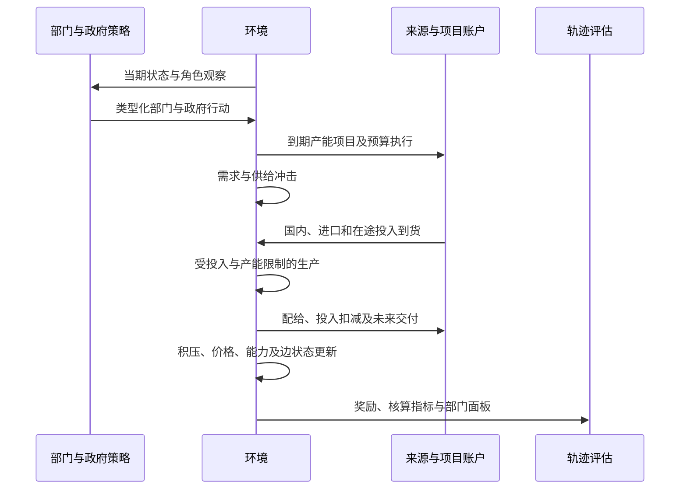

# IC-EconGym: An Input–Output-Constrained Multi-Agent Testbed for Semiconductor Industrial Policy and Supply-Chain Resilience

**中文题名：** IC-EconGym：投入产出约束下的集成电路产业政策与供应链韧性多智能体测试平台

## 摘要

产业政策智能体的效果取决于其行动能否经过投入依赖、产能限制和交付约束转化为实际供给。通用经济仿真接口与静态投入产出分析分别提供了策略替换和部门核算的基础，但二者之间仍需要可执行、可诊断的产业环境。本文提出 IC-EconGym，以经细分处理的 2020 年投入产出结构构建 13 个相关产业部门与 1 个政府智能体，将其余 42 个国内部门、进口和最终需求保留为显式边界。平台在统一状态转移下执行订单、分来源投入到货、受约束生产、交付配给和预算结算，并以配置接口组织赋能、风险、治理三组共 15 项条件机制任务。针对内部订单由策略内生生成的问题，平台分别记录总订单短缺与共同外生最终需求的履约，支持同冲击、同观察权限和同财政预算下的策略比较。实验包含 780 条配对启发式轨迹及 426 条新增机制诊断轨迹。结果表明，相同 AI 支出下的吸收能力提升在基期需求已满足时不增加交付，在部门需求扩张后才产生有限改善；R1 中需求跟随与库存平滑相对既定规则的最终需求履约率分别降低约 1.6446 和 0.3375 个百分点；G5 中短缺靶向的改善仅约 0.000298 个百分点。关闭承接边通道未改变这两组情景的履约结果，说明策略比较还必须检验机制是否影响生产可行域。本文提供可复现的部门级测试环境、任务配置和诊断协议；行为参数属于情景设定，独立外部验证与学习型策略基准尚待完成。

**关键词：** 多智能体测试平台；投入产出约束；集成电路相关产业；供应链韧性；产业政策；机制诊断

## 1 Introduction

经济智能体的行动不能仅通过奖励函数中的加分项表示。扩产需要占用资源并等待投产，库存支持需要形成可用投入，部门产出还可能受到某一种上游产品限制。若这些约束没有进入环境转移，局部策略的高收益无法说明其提高了系统交付。对于集成电路相关产业，这一问题尤其突出：设计、制造、材料、设备与应用之间存在多种依赖，但宏观统计部门与工艺环节并非一一对应；部门总量、企业关系和产品交易额也具有不同的证据含义。

半导体行业的这一特征已有产业证据。OECD 的价值链研究把设计、制造、设备、材料和终端应用的联系置于全球专业化分工中；SIA 与 BCG 的行业报告同时讨论专业化的效率来源和关键环节集中带来的脆弱性 [1, 2]。美国商务部对 2021 年短缺的自愿调查还记录了重点芯片需求增长、买方库存下降与晶圆产能瓶颈并存的现象 [3]。这些资料说明需求、可用投入与产能需要共同建模，但其行业粒度、地域和计量单位不能直接移植到中国广义统计部门。

生产网络理论说明，部门特有冲击可以经直接与间接投入联系形成总体波动 [4]。动态投入产出模型进一步把需求、供给和库存纳入非均衡生产过程，并检验了冲击传播的预测能力 [5]。与此同时，EconGym 将多类经济角色与可替换策略组织为统一测试环境，以算法基准、现实贴合和运行效率支撑其平台主张 [6]。这两条研究路径为产业智能体实验提供了基础，但尚不能直接把通用家庭、银行或政府策略移植到具有分来源投入约束的产业部门，也不能把部门表直接解释为企业交易网络。

AI 赋能和产业政策也需要区分投入与已实现效果。吸收能力研究强调组织识别、吸收并应用外部知识的条件，技术—组织互补研究则说明技术投资需要配套资产 [7, 8, 9]。任务层效率向总量效应的转化还依赖受影响活动的覆盖范围 [10]。对于政策，近期产业政策综述强调测量、因果识别、实施治理和具体经济结构 [11]。因此，本文关注能力、订单与财政行动经过约束后产生的交付，而将现实政策有效性留给额外的行为识别与外部验证。

IC-EconGym 将部门核算结构转化为策略可作用的逐期环境。13 个相关部门分别提出生产计划、补库目标、价格调整和能力投入；政府在一次性总预算内选择支出渠道与部门配置。环境决定哪些计划能够生产、哪些交付可以到达，以及哪些项目只能在后续期生效。策略与经济结算分别实现，因而可在保持核算来源和观察权限一致的条件下替换策略、改变冲击和关闭机制。

本文围绕三个研究问题开展实验。

- **RQ1，能力转化的约束条件。** 相同 AI 支出下，提高吸收能力何时改善最终交付，何时仅改变能力状态？
- **RQ2，策略响应与系统交付。** 需求跟随、补库和供给通道选择如何改变内部订单，以及共同外生最终需求的履约？
- **RQ3，有限预算的配置效果。** 均匀、后向关联度和短缺靶向在相同财政资源下产生多大差异，该差异是否依赖机制和进口用途分配？

这些问题的共同要求是将“行动改变了状态”与“行动改善了交付”分开检验。平台据此提供三项贡献。**第一，分来源的可执行投入约束。** 国内、进口和其他国内部门边界分别形成可用投入，生产、交付、项目投产与财政行动处于统一时序。**第二，可组合的任务与策略接口。** 同一结算引擎支持 15 项任务及类型化部门、政府行动，参数和机制开关保存在可追踪配置中。**第三，面向内生订单与非绑定机制的评估协议。** 平台以共同最终需求计量履约，结合配对冲击、成本报告和机制关闭实验，识别策略差异的条件及无效干预。

本文研究对象是集成电路相关部门的条件机制实验。2020 年核算表识别基期用途和投入比例，细分结构包含收入分劈假设；AI、投资、库存和合同参数未由该表估计。本文的结果解释为模型内策略与机制比较，不解释为现实政策因果效应。

## 2 Related Work and Positioning

### 2.1 经济策略学习与测试平台

AI Economist 通过经济主体与规划者的两层深度多智能体强化学习研究税收设计，表明政策比较需要考虑主体对政策的响应 [12]。EconGym 进一步组织多角色和多任务，比较规则、学习及语言模型等策略，并考察跨政策协同 [6]。IC-EconGym 借鉴其角色、观察、行动、奖励和环境结算的分离方式，新增的研究对象是受投入来源、库存与产能约束的产业部门。原平台已训练的家庭或银行策略不构成本文部门基线；所有候选策略都必须适配本文的观察字段和行动结构。

现有实验使用规则与启发式，没有进行强化学习训练、语言模型调用或训练—测试泛化比较。本文因此将“可替换策略的测试环境”作为已实现能力，将“学习型算法基准”作为后续验证项。规则策略对状态作固定公式响应，也不等于其在运行中学习。

这一实现属于计算经济学的规则主体路径。Tesfatsion 将经济过程表示为主体反复交互的动态系统，主体可以包含行为规则、属性与制度约束 [13]；Littman 的多主体框架则明确联合行动如何进入环境状态转移 [14]。本文沿用主体—行动—转移的组织方式，观察受角色权限限制，但不据此宣称已经求得博弈均衡或学习到经济行为。

### 2.2 投入产出结构与供应网络仿真

Acemoglu 等说明高阶投入依赖在部门冲击向总量波动的传导中具有重要作用 [4]。Pichler 等以动态投入产出模型表示行业供需冲击、库存和生产限制，并使用独立经济活动数据检验预测 [5]。本文沿用固定投入与库存约束的建模思路，重点提供策略接口、共同预算比较和机制诊断；没有完成与其同等的历史预测验证。

固定投入系数与 Leontief 关联分析提供了部门核算基础 [15]。Hallegatte 的 ARIO 模型进一步把产能和前后向传播用于灾害损失分析，说明重建需求只有经过产能约束才能转化为生产 [16]。Carvalho 等利用东日本大地震及企业关系数据识别了上下游冲击传播 [17]。这些研究支持在环境中保留投入依赖与产能，但理论网络、统计部门网络和观测企业网络分别支持不同层级的结论。

企业级供应链模型依赖更细的关系资料。Inoue 和 Todo 使用日本企业供应关系构建动态 ABM，并结合销售额与投入产出表推估交易权重 [18]。关系观测与交易额识别在该研究中也需区分。本文工作区的 206 家企业和 8,364 条候选边尚未具备保持部门核算总量的业务份额和逐产品权重，因此未载入当前生产转移。三个合成供给通道仅用于集中与拥堵实验。

库存与信息反馈属于另一层行为机制。Clark 和 Scarf 的多级库存研究表明，上游库存和交付提前期需要联动 [19]；Sterman 的实验研究讨论决策者对库存与反馈的误判 [20]；Lee 等将订单信息失真与终端销售区分，并分析牛鞭效应的多种来源 [21]。本文用这些研究解释补库和订单反馈的建模理由，具体系数仍由任务设定，且不把最终短缺变化直接称为牛鞭效应。

### 2.3 经济世界模型的系统边界

Han 等提出经济世界模型的能力阶梯与实现协议，将主体、环境、共演化、现实对齐和评估分开，并区分信念更新、行动、状态转移、聚合和制度演化 [22]。该文当前为 arXiv 预印本，本文借鉴的是其系统分类与诊断原则。IC-EconGym 已实现固定规则主体、环境执行和只读轨迹评价；未实现显式信念更新、持续策略学习、制度内生演化或在线数据纠正。政府在预算内选择支出属于行动，不构成制度自演化。

**表 1 系统定位与证据边界**

| 研究 | 核心对象 | 与本文相关的能力 | 本文采用或尚缺的部分 |
|---|---|---|---|
| EconGym [6] | 多角色经济任务与算法 | 模块化角色、跨任务策略比较、外部贴合及效率 | 采用接口组织；产业策略需重新实现 |
| AI Economist [12] | 主体与规划者共同学习 | 政策—主体响应及训练评估 | 当前没有两层学习实验 |
| 动态投入产出模型 [5] | 部门供需与库存传播 | 受投入约束的动态生产、独立预测检验 | 保留投入边界；未完成独立预测检验 |
| 企业供应网络 ABM [18] | 实际企业关系与传播 | 库存、替代与细粒度关系 | 当前仅部门级，候选企业边不等于实际关系 |
| EWM 系统蓝图 [22] | 能力阶梯与实现协议 | 类型化接口及分层诊断 | 已实现执行与评估，未实现共演化与现实对齐 |

模型报告参照 ODD 对实体、状态、时序、初始化、输入和子模型的要求 [23]，完整代码映射见附录 B。ODD 是描述与复现规范，不构成经济准确性的验证。

### 2.4 技术吸收、投资时滞与产业政策

Cohen 和 Levinthal 将吸收能力与既有知识及研发联系起来 [7]。Brynjolfsson 等关于组织资本和生产率 J 曲线的研究说明，通用技术的收益可能依赖互补投入与测量时序 [8, 9]。生成式 AI 的客服实证进一步发现，效果在经验和技能维度上具有异质性 [24]。本文据此区分采用存量、有效 AI 和交付绩效；部门级乘法转化式并非上述企业或劳动者研究估计出的函数。

Kydland 和 Prescott 的 time-to-build 研究为资本支出与可用生产资本之间的跨期分离提供了经典依据 [25]。Dosi 等在经济 ABM 中组织需求、创新、投资与政策反馈 [26]，Juhász 等则将产业政策的工具、实施与识别置于具体结构中讨论 [11]。本平台将投产队列与政府支出接口显式化，用于条件反事实；其财政权重和投产效率没有继承文献的经验估计。

### 2.5 产业粒度与模型验证

OECD 的半导体脆弱性研究指出，投入产出记录需要配合更细行业资料才能识别关键联系；设备资本购置也不能仅由中间使用矩阵表达 [27]。其晶圆产能研究按工艺、节点及经营模式区分产能与替代限制 [28]。这些分类为未来细化 H 机制提供方向，当前广义部门与合成通道仍保留自身统计边界。

验证方法同样需要分层。Sargent 区分概念模型、代码、运行结果与数据的有效性 [29]；Fagiolo 等讨论经济 ABM 中校准、经验事实与验证程序的关系 [30]。据此，本文分别报告核算和代码检查、模型内机制实验及尚未完成的外部验证，不以文献中的现实证据替代本环境的独立检验。

## 3 Data and Economic Boundary

### 3.1 部门划分与计量单位

输入是项目整理的 2020 年投入产出工作簿。原 42 部门经营业收入比例分劈形成 55 部门，其中前 13 个作为决策主体，其余 42 个为外部国内供给和需求边界。13 个主体包括材料、设备、电子投入、电子制造和应用部门，具体统计标签与分劈份额见附录 A。它们代表集成电路相关经济活动，并非 13 个分别观测的芯片工艺环节。第 8 部门仍是电子设备制造统计范围，H3 设计、H4 晶圆制造、H5 封测标签不能被解释为已识别的独立交易额。

金额单位为万元。令 $x_j$ 为年度基期产出，季度基准为 $q_j^0=x_j/4$。模型中的生产与投入是固定 2020 年价格的产出当量，不是晶圆片数、芯片颗数或物理产线吞吐。年度转季度采用四个等长期间，没有估计季节性。价格状态用于收益和价格诊断，未用于重新估计投入系数。

### 3.2 国内与进口投入

记国内和进口中间使用为 $z^d_{rj}$、$z^m_{rj}$，国内最终使用为 $y^d_{rc}$，其中 $r=1,\ldots,55$、$j=1,\ldots,13$。固定投入系数为

\[
a^d_{rj}=\frac{z^d_{rj}}{x_j},\qquad a^m_{rj}=\frac{z^m_{rj}}{x_j}.
\tag{1}
\]

13 部门向其余国内部门销售的季度基准为 $X_r^0=\sum_{j=14}^{55}z^d_{rj}/4$，最终需求基准为 $F_r^0=\sum_c y^d_{rc}/4$。因此研究部门的基期产品用途满足

\[
q_r^0=\sum_{j=1}^{13}\frac{z^d_{rj}}4+X_r^0+F_r^0,
\qquad
x_j=\sum_{r=1}^{55}(z^d_{rj}+z^m_{rj})+VA_j^0.
\tag{2}
\]

现有资料没有识别每种进口产品的实际使用者。平台提供比例分配、优先中间使用、优先最终使用三种平衡假设，均保持核算总量并不将进口配置给出口用途。不同假设改变国内与进口来源约束，不能称为三套观测供应链。预处理最大行、列绝对残差分别为 $5.96\times10^{-6}$ 与 $7.39\times10^{-6}$ 万元；数值平衡反映构造一致性，不是预测精度。

式（1）—（2）的系数和用途核算采用投入产出分析的通常定义 [15]。收入分劈与进口使用分配属于本文数据处理选择。对于专用设备，资本形成中的新设备购置及其产能服务还需独立投资资料，不能仅凭设备部门的中间投入边推断完整扩产关系 [27]。

### 3.3 数据、参数与证据来源

**表 2 核算信息与情景信息**

| 信息 | 当前来源 | 模型中的用途 | 识别边界 |
|---|---|---|---|
| 年产出、投入、增加值 | 2020 年工作簿及收入分劈 | 季度基准、固定投入系数 | 细分结构含研究者分劈，不是逐笔观测 |
| 进口用途 | 三种平衡分配 | 分来源生产约束 | 进口实际使用者未知 |
| 吸收、预测、投资、积压、交付系数 | YAML 与代码设定 | 跨期状态转移 | 未由投入产出表估计 |
| 企业节点与候选边 | 项目企业资料 | 未来企业级扩展的证据支持集 | 当前已识别 2020 业务份额为 0/206 |
| 政府目标与权重 | 任务配置 | 支出和奖励 | 非经验社会福利函数 |

处理后的矩阵、标签、审计与来源哈希已经发布。原始工作簿及收入分劈依据未随仓库分发，公开包支持从处理矩阵重现仿真，尚不能独立重建全部预处理。原始统计来源、分劈年份和数据使用许可仍需由作者补充确认。

### 3.4 参数设定依据与识别状态

本文分别记录核算量、理论支持的机制形式、任务情景参数与数值实现设置。文献使规则的选择理由可追踪；具体系数只有经过与研究对象相符的估计才能称为经验参数。模型验证研究也要求把参数校准与结果检验分开 [29, 30]。表 P1—P2 列出正文主要参数；完整配置保留在 YAML 和实验元数据中，任务覆盖值优先于代码默认值。

**表 P1 核算、能力与资源参数**

| 参数组 | 当前数值／定义 | 文献依据与参数身份 |
|---|---|---|
| 核算与期间 | $a^d=z^d/x$、$a^m=z^m/x$；年度流量除以 4 | [15] 支持核算定义；四等分是无季节性转换约定 |
| 基期初始化 | 产能与产出为 $q^0$；成品与材料初值 0；一期内部在途为基期流量 | ODD 要求报告初始化 [23]；此处是工程设定，不代表实测库存 |
| 吸收与摩擦 | 角色吸收 0.50—0.65、摩擦 0.09—0.14；时间适配 0.9；E1 吸收 0.2／0.9 | [7, 8] 支持互补和异质性；函数与数值均为情景设定 |
| AI 转化与产能 | 转化默认 0.1；生产率增益默认 0.1、E1 为 0.3；E1 支出率 0.02 | [9] 支持采用与实现效果分离；数值未估计 |
| 研发与技术 | 转化默认 0.01、折旧 0.001、AI 互补 0.5；E3 转化 0.1、折旧 0.00001 | [7, 26] 为研发和能力积累背景；默认与任务覆盖值分别报告 |
| 补库与积压 | 补库速度 0.25；平滑策略目标 0.25 季度；积压保留 0.25、上限 2 季度 | [19, 20] 支持库存反馈；不是最优库存或实测取消率 |
| 外部来源上限 | 计划到货上限为基期投入的 1.25 倍 | [5] 与 [16, 27] 支持供给约束；1.25 未由统计表识别 |
| 资本项目 | 私人／政府默认转化 0.1；默认滞后 4 季度；R1 为 6，对照为 2／10 | [25, 28] 支持跨期形成；固定滞后与效率不是文献估计 |

**表 P2 选择、治理与实验参数**

| 参数组 | 当前数值／定义 | 文献依据与参数身份 |
|---|---|---|
| 供给通道 | 3 槽；质量 1／0.9／0.8；偏置 0／0.03／0.05；容量份额 0.45／0.40／0.35；R4 精度 0／5／12、容量乘子 1.05 | [31, 32] 支持 Logit 形式；槽、容量和效用均为合成设定 |
| 预测误差 | E2 标准差 0.12、AI 降误差系数 0.6；R3 标准差 0.2、共同载荷 0／0.5／0.95 | [20, 21] 提供信息反馈背景；高斯过程及系数为情景值 |
| 边与资格 | 压力记忆 0.70；健康下限 0.85；资格初始为 1，内部运输基准 1 季度 | [18] 与 [17] 支持传播动机；式（B3）系数与资格规则由本文设定 |
| 价格与成本 | 自动调价系数 0.05，单步项截断 ±0.05；动作项截断 ±0.1；劳动其他成本份额 0.8 | [26] 为 ABM 定价背景；本缺口式调价及份额未经验校准 |
| 合同与协同 | G3 核验强度 0.1／0.5／0.9；惩罚 0.2；剩余权重 0.5；份额网格 101 点 | [32, 33] 支持目标与选择形式；强度、系数及网格属于情景／数值设置 |
| 努力配置 | 5 种努力、上限 1；成本系数为 1；预算默认 1 | [34] 支持优化条件；收益权重与预算由本文设定 |
| 财政与冲击 | G5 初始预算为季度基准总产出的 1%；每期花费余款 0.25；产能损失 0.2；R1 需求增量 0.3 | [11] 支持条件化政策评价；该数值非现实财政占比或实测冲击 |
| 实验与扰动 | 30 季度；10 个匹配种子；冲击离散标准差 0.04；名义 OFAT ±20% | [30, 35] 支持报告不确定性；期间和范围是实验设计，非置信区间 |

上述文献未提供本稿的吸收率、扩产速度、取消率、槽容量或财政权重。它们用于构造可比较条件，不承担中国集成电路产业的点预测。参数范围目前由对照任务和单因素扰动给出；联合采样与范围的经验依据仍需补充。将 OAT／OFAT 当作全局敏感性证据会遗漏交互方向 [35]。

## 4 IC-EconGym Environment

### 4.1 决策主体与环境状态

令主体集合为 $\mathcal N=\{1,\ldots,13,g\}$，任务 $\tau$ 声明机制、冲击、观察、策略和有限期间 $H$。全环境状态包含部门产出与产能、分来源投入库存、成品库存、积压、价格、AI 与技术存量、边压力与资格、在途交付队列、待投产项目、剩余财政预算和时期。对合法行动，转移写为

\[
o_{i,t}=\mathcal O_i(s_t),\quad a_{i,t}=\pi_i(o_{i,t}),\quad
s_{t+1}=T_\tau(s_t,a_{1:13,t},a_{g,t},u_t;A^d,A^m).
\tag{3}
\]

这里 $u_t$ 是声明的外生需求或供给冲击。完整状态包含在途与项目队列；仅给出当期产出向量不足以定义下一期。当前策略系数在一次运行内固定，环境状态演化不被称为策略学习。

式（3）采用交互主体与联合行动的环境表述 [13, 14]。状态和观察分别定义，使部门能够按局部信息决策，而在途投入、财政和项目仍由环境执行。实体、状态、初始化与调度遵循 ODD 的报告要求 [23]；这些接口定义并不保证局部观察构成马尔可夫充分统计量。

**表 3 主体接口与可行域**

| 主体 | 可观察信息 | 类型化行动 | 约束与奖励 |
|---|---|---|---|
| 部门 $j$ | 自身产出、基准、产能、成品库存、积压、价格、AI、有效 AI、技术、吸收；相连部门编号、上游价格与健康；上一期总需求、政府剩余预算 | 生产计划、内部投入补库目标、价格调整、资本／研发／AI 支出份额、协同、多元化 | 有限数值、非负份额、角色权限；经营现金流式奖励 |
| 政府 $g$ | 各部门产出、增加值、价格、短缺、积压、技术、有效 AI、关联度、边健康与财政预算 | 六类长度为 13 的非负支出向量 | 请求按剩余总预算缩放；配置权重下的系统奖励 |

部门观察不包含完整原料库存、在途队列或其他部门全部私人状态，`inventory` 指自身成品库存。角色表声明可用行动，但当前 13 个角色的控制字段相同，异质性主要来自投入位置、规模、吸收和摩擦。私人投入计入奖励和成本，没有由现金存量或融资约束形成的企业硬预算；银行、家庭和劳动力市场未单独建模。本文因而只主张投入用途、库存执行与政府预算约束，不主张全经济金融账户闭合。


图 1 平台决策主体、环境与显式边界。其他 42 个部门、进口和最终使用没有独立策略。

### 4.2 订单与分来源到货

环境将生产计划截断为 $\widehat q_{j,t}\in[0,2q_j^0]$。内部国内订单为

\[
O^d_{rj,t}=a^d_{rj}\widehat q_{j,t}
+\lambda_I\left[\iota_{j,t}z^d_{rj}/4-M^d_{rj,t}\right]_+,
\qquad r\leq13,
\tag{4}
\]

式（4）采用目标库存缺口的补库思想，与多级库存控制及库存调整启发式的机制背景相连 [19, 20]。本规则没有把全部在途量组成经典库存位置，也未求解最优目标。订单由计划与补库共同生成，因此需要与终端需求分别计量 [21]。

其中 $\iota_{j,t}$ 为补库目标的季度数，$\lambda_I$ 为补库调节系数。内部订单由行动生成。其他国内来源和进口每期按计划需求与基期外部供给上限的较小值到货；以进口为例，

\[
R^m_{rj,t}=\min\{a^m_{rj}\widehat q_{j,t},\ \epsilon_{ext}z^m_{rj}/4\}\,\chi_{rj,t}.
\tag{5}
\]

$\chi_{rj,t}$ 是外部投入冲击乘子，国内外部来源采用同类规则。二者单独入账，当前没有进口与国产的自动替代。政府库存支持在启用库存机制时从其他国内部门边界购买额外投入；这会改变可用资源，不是最终交付上的直接加成。

### 4.3 生产与配给

令当期销售请求为 $D_{r,t}=\sum_j O^d_{rj,t}+X_r^0+F_{r,t}+b_{r,t}$，$b_{r,t}$ 为期初积压。有效产能综合冲击、AI、技术及启用的制造约束。生产执行

\[
q_{j,t}=\left[\min\left\{
\widehat q_{j,t}+b_{j,t},D_{j,t},K^{eff}_{j,t},
\min_{r:a^d_{rj}>0}\frac{M^d_{rj,t}}{a^d_{rj}},
\min_{r:a^m_{rj}>0}\frac{M^m_{rj,t}}{a^m_{rj}}
\right\}\right]_+.
\tag{6}
\]

实现中小于或等于 $10^{-12}$ 的投入系数不构成瓶颈上界；生产后按固定投入系数扣减材料。成品可用量为当期产出加期初成品库存。环境先满足内部投入订单，剩余按比例分配给其他国内部门、当期最终使用及旧积压。这一配给顺序是制度假设，不是由统计表估计的市场清算规则。没有最终使用者的价格弹性或效用最大化过程。

固定比例投入由 Leontief 技术提供核算基础 [15]，式（6）的需求、产能和库存共同限制与 ARIO 及动态投入产出模型的非均衡生产思路相连 [16] [5]。本文的中间品优先配给、来源分账和截断顺序按当前引擎定义，不能从经典投入产出系数推导出唯一配给制度。

未售出产品转成品库存。总未满足订单 $S_{r,t}$ 按设定保留率转积压：

\[
b_{r,t+1}=\min\{\rho_B S_{r,t},\ \overline b q_r^0\}.
\tag{7}
\]

积压未保留部门内中间、最终和旧订单的批次身份，因而不能计算逐客户等待时间或延迟交付满意度。内部已发运投入在至少一个季度后进入接收方材料库存；代码以发运量乘边健康 $h_{rj,t}$ 和资格 $\nu_{rj,t}$ 形成后续有效到货。两者在当前实现中是可用量折损系数，不是逐晶圆良率或失效事件的经验概率。折损没有另设物理废料账户，不宜把该过程称为逐物料完全守恒的物流系统。

### 4.4 能力、承接边与供给通道

有效 AI 为

\[
\alpha_{j,t}=\operatorname{clip}\left(
\frac{AI_{j,t}\,\eta_j\,\phi}{1+f_j},0,3\right),
\tag{8}
\]

其中 $\eta_j$ 为吸收能力，$\phi$ 为时间适配，$f_j$ 为组织摩擦。启用 AI 时，产能乘以 $1+\beta_{AI}\alpha_{j,t}$；AI 还可降低设定的劳动与其他成本，并提高研发转化系数。研发形成无量纲技术状态，技术产能增益只取超过基准 1 的正部分。采用、吸收、研发折旧与转化均为情景参数。

采用与吸收的分离借鉴吸收能力和组织资本研究 [7, 8]，互补投入和收益形成的跨期性可与生产率 J 曲线研究对话 [9]。式（8）的乘法与摩擦分母是本文的简化转化函数，未从这些论文的企业或劳动者估计中移植。

**命题 1，局部产能增益的条件。** 在给定期初材料、需求、计划、积压及其他机制状态的条件下，令 $L_{j,t}$ 为式（6）中除有效产能外各上界的最小值，且有效产能为 $K_{j,t}(1+\beta_{AI}\alpha_{j,t})$。则

\[
\frac{\partial q_{j,t}}{\partial\alpha_{j,t}}=
\begin{cases}
K_{j,t}\beta_{AI},&K_{j,t}(1+\beta_{AI}\alpha_{j,t})<L_{j,t},\\
0,&K_{j,t}(1+\beta_{AI}\alpha_{j,t})>L_{j,t}.
\end{cases}
\tag{9}
\]

相等处一般不可微。命题直接来自最小值约束，证明见附录 C；它是固定其他条件的局部性质，不保证多期网络中的总体收益或最优投资方向。E1 实验检验能力增益何时进入实际交付。

承接边压力由有效 AI 与下游吸收的正错配、订单—到货缺口、协同和修复共同更新，健康度经截断映射形成。该机制必须达到触发条件并改变后续生产约束，才能影响系统结果。资格初值为 1，当前规则仅增加并截断至 1；因此未附加资格退化的标准情景中，资格支持不存在改善空间。

启用供给选择时，产品来源部门内部设置三个合成通道。质量分值为 $(1,0.9,0.8)$，通道偏置为 $(0,0.03,0.05)$，选择权重与容量为

\[
p_{rc}=\frac{\exp(\kappa q_c-d_c)}{\sum_{c'}\exp(\kappa q_{c'}-d_{c'})},
\qquad
\mathcal K_{rc}=s_c\gamma\sum_j z^d_{rj}/4,
\tag{10}
\]

其中 $s=(0.45,0.40,0.35)$、$\kappa$ 为搜索精度、$\gamma$ 为通道容量乘子。通道需求超过容量后削减内部交付，HHI 为 $\sum_c p_{rc}^2$。这是一项受容量约束的选择机制，不是企业真实供应商识别、网络重连或最优采购模型。R4 用于检验集中与拥堵的条件关系。

式（10）的归一化指数形式借鉴条件 Logit [31, 32]。当前代码直接用权重分配订单，未估计效用系数或抽取真实企业选择。Logit 的替代结构与其选择集合有关，真实半导体设备和工艺是否可替代还需专门资料 [27, 28]。

### 4.5 投资、政府预算与奖励

私人资本、研发与 AI 支出为相应行动份额乘以 $q_j^0$。私人资本支出经过设定滞后转为产能，政府产能支出另进入项目队列。收益以价格加权交付为收入，扣除投入、设定的劳动其他成本、库存与总短缺代价；部门奖励再扣除当期私人能力投入。固定价格增加值为 $a_j^{VA}q_{j,t}$，并不因为 AI 降低设定成本而自动改变增加值系数。

将投资先记为项目、再形成可用产能，以 time-to-build 文献为机制依据 [25]。创新、计划、投资及定价的启发式组合可与经济 ABM 研究比较 [26]；本项目的线性转化、固定时滞与成本权重另行设定，并未继承其均衡或行为估计。

政府请求 $G_{jk,t}\geq0$ 经剩余预算 $\mathcal B_t$ 缩放为实际支出：

\[
g_{jk,t}=G_{jk,t}\min\left\{1,\frac{\mathcal B_t}{\sum_{j,k}G_{jk,t}}\right\},\quad
\mathcal B_{t+1}=\mathcal B_t-\sum_{j,k}g_{jk,t},
\tag{11}
\]

总请求为零时实际支出为零。对于有限非负请求，式（11）保证实际支出不超过预算。预算为整个运行的一次性总额，没有自动季度补充。六个渠道为 AI、产能、研发、资格、库存和边修复；支出是否改变产出还取决于对应机制和约束。政府奖励是配置权重下的增加值、技术、履约、价格波动、总短缺、财政与集中度的组合，不解释为已估计的社会福利。

协同模块将设定激励与短缺率映射为 Logit 协同概率，并使用受预算约束的二次目标分配五种努力。条件 Nash 式激励份额通过有限网格求得，用于协同概率；没有独立的平台智能体或相应现金转移账户。有关公式和局限见附录 B。

协同概率使用离散选择的 Logit 形式 [32]，双方非负剩余乘积借鉴 Nash 谈判目标 [33]，努力配置则采用可分离凹目标的 KKT 条件 [34]。它们为风格化规则提供形式依据，有限网格与激励映射不等于完整谈判均衡。政府目标和工具的经济解释参照产业政策评价中对具体约束与实施条件的强调 [11]。

### 4.6 更新时序与实现



图 2 合法行动下的季度更新顺序。动作的调用顺序与环境内生效顺序分别由策略接口和结算代码决定。

运行时提供 `reset / run_agents / step / evaluate`，任务配置和随机种子可追踪。该接口用于环境式执行，尚不宣称完全兼容 Gymnasium 或 PettingZoo。静态项目页面回放预计算轨迹，浏览器选择操作不重新运行模型。

固定调度、初始化和子模型顺序依据 ODD 报告 [23]；结算执行和独立评价的区分借鉴测试平台及系统蓝图 [6, 22]。代码与概念规则的一致性通过实现检查评价，现实适用性需要另行验证 [29]。

## 5 Benchmark Tasks and Evaluation Protocol

### 5.1 任务组合与可检验对象

15 项任务共享结算引擎，分别改变能力、风险或治理配置。任务名称声明研究意图，不意味着该机制已经触发或经经验验证。

**表 4 任务机制与评价对象**

| 任务 | 配置名称 | 机制 | 评价对象 |
|---|---|---|---|
| E1 | AI有效生产率 | 采用、吸收与产能增益 | 有效 AI、产能及最终履约 |
| E2 | AI预测与供应链协同 | 随机预测误差与订单响应 | 误差设定、订单、短缺 |
| E3 | AI与研发效率 | AI—研发转化互补 | 技术状态及交付转化 |
| E4 | AI与供应商匹配 | 合成通道偏好与容量 | HHI、拥堵及最终履约 |
| E5 | AI需求与产业结构 | 设定需求扩张与扩产 | 需求、产出、项目及短缺 |
| R1 | 需求扩张与产能周期 | 资本滞后与订单反馈 | 内部订单、产能及最终履约 |
| R2 | AI扩散与承接错配 | 能力—承接正错配 | 阈值、边压力及有效到货 |
| R3 | 共同预测误判 | 共同预测误差载荷 | 跨部门误差、订单及短缺 |
| R4 | 算法采购与供给集中 | 搜索集中与通道拥堵 | HHI、拥堵及最终履约 |
| R5 | AI异质性与市场势力 | 异质能力与 HHI 加价 | 能力、集中、价格及交付 |
| G1 | AI补贴配置 | AI 支持的部门配置 | 有效 AI、财政成本及交付 |
| G2 | AI与实体能力组合政策 | AI 与实体能力支出组合 | 投产、成本及最终履约 |
| G3 | 数字契约与可核验协同 | 条件合同与核验激励 | 协同强度及交付转化 |
| G4 | 库存认证与修复 | 库存、资格与边修复 | 资格、库存、到货及交付 |
| G5 | 多目标政策组合 | 渠道组合与部门靶向 | 共同预算、最终履约及成本 |

每题至少同时记录机制状态、最终需求交付、增加值及成本。E1、R1、R4、G5 作为正文案例，分别覆盖能力转化、订单反馈、供给拥堵和有限预算靶向。其他任务的配置和逐臂诊断见附录 D；未激活的机制作为诊断结果报告。

### 5.2 部门与政府基线

设 $d_{j,t}$ 为部门观察到的上一期总订单与基期产出的比。三种部门策略分别为

\[
\widehat q^R_{j,t}=q_j^0\operatorname{clip}(0.7+0.3d_{j,t},0.3,1.8),
\tag{12}
\]
\[
\widehat q^D_{j,t}=q_j^0\operatorname{clip}(d_{j,t},0.3,2),\qquad
\widehat q^S_{j,t}=q_j^0\operatorname{clip}(0.5+0.5d_{j,t},0.3,2).
\tag{13}
\]

库存平滑策略另设内部材料库存目标 0.25 个季度。三者使用相同观察结构，研发、AI 与资本行动沿用规则模块；补库与产量反馈造成的后续私人支出可能不同。比较保证相同接口和外生资源，不保证相同已实现私人投入，相关成本单列报告。它们是透明启发式，不是强化学习、最优控制或求解均衡的算法。

需求响应和库存调整作为基线，源自库存控制与行为反馈研究提供的可解释规则族 [19, 20]。式（12）—（13）的平滑权重由本文指定，未复刻文献的估计策略或最优控制器。关联度靶向使用经典后向联系的结构指标 [15]，加入短缺权重则是本平台的政策启发式。

令 $\ell_j$ 为完整 55 部门国内 Leontief 逆矩阵列和的标准化值。政府三种权重为

\[
w_j^U\propto1,\qquad w_j^L\propto\ell_j,\qquad
w_{j,t}^S\propto\ell_j\left(0.1+\frac{S_{j,t-1}}{\max(q_j^0,1)}\right).
\tag{14}
\]

三种政府策略共用支出渠道、起始期、总预算和每期剩余预算支出比例 0.25，仅替换部门靶向。短缺靶向使用总订单短缺作为可见状态；评价则独立使用最终需求履约，避免将策略自身的目标或中间量视为绩效。

### 5.3 内生订单与共同最终需求指标

订单与最终销售的区分可与订单信息失真研究相连 [21]。式（15）以本模型共同外生需求构造任务绩效；它不是文献牛鞭方差指标或现实社会福利度量。

总订单短缺混合了策略生成的内部需求、当期外部需求与旧积压。减少内部订单可能改变总短缺和总订单服务率的分母，因此仅凭其排序不足以比较相同最终使用需求下的服务能力。令 $C_{j,t}$ 为当期最终交付，主要指标为

\[
S^F=\sum_t\sum_j[F_{j,t}-C_{j,t}]_+,\qquad
\Phi^F=\frac{\sum_t\sum_jC_{j,t}}{\sum_t\sum_jF_{j,t}}.
\tag{15}
\]

同一配对情景中的 $F_{j,t}$ 对各策略相同。$\Phi^F$ 是需求加权的跨期当期履约率，不是逐期比例的平均，也不追踪旧最终订单的迟交。总订单短缺、固定价格增加值、价格、私人投入和财政支出作为辅助指标。对于相同情景 $c$ 与种子 $s$，政策比较报告

\[
\Delta\Phi^F_{c,s}(\pi,\pi_0)=\Phi^F_{c,s}(\pi)-\Phi^F_{c,s}(\pi_0).
\tag{16}
\]

先在相同冲击内计算差异，再汇总均值与范围。图表中的“百分点”均为比例差乘 100，不与百分比相对变化混用。种子分散来自设定冲击，不代表现实样本抽样，本文不据此作现实政策显著性推断。

### 5.4 实验矩阵与机制诊断

R1 在第 4—11 期对第 12 部门施加最终需求增加；G5 在第 5—9 期降低第 8 部门产能。每条轨迹 30 个季度，种子为 42—51。冲击幅度乘以 $\max\{0,1+0.04\xi_s\}$，其中 $\xi_s\sim N(0,1)$ 由种子 $s+15011$ 生成。该分布表示研究者指定的情景扰动。三种进口分配加每题五项单因素名义 ±20% 扰动形成 13 个情景，每题 $13\times3\times10=390$ 条轨迹，共 780 条。整数滞后四舍五入，健康下限截断至 1，实际值见附录 E。

新增实验保持结算引擎和原 15 题配置不变。**E1 约束激活实验**在相同 AI 支出下比较吸收 0.2 与 0.9，分别使用基期需求和第 10—19 期第 8 部门 30% 的需求增加；基期无随机机制，每个进口与吸收组合只运行一次，共 6 次，需求冲击组为 60 次。**通道关闭实验**对 R1、G5 的三种进口分配和 10 个匹配种子分别关闭承接边更新、私人资本投资，共 360 次。私人投资关闭后政府产能渠道仍保留；这些是明确改变通道的条件反事实，不能视为现实识别或纯信息消融。

本文以“配置启用—中间状态变化—生产可行域变化—交付变化”逐层评价机制。一个任务若只改变有效 AI 或协同概率而未改善最终交付，应报告状态与绩效的分离。已有演示包含 50 个对照臂、3 个种子和 30 期，共 150 次；未启用随机机制的重复种子不作为独立统计重复。

## 6 Experiments

### 6.1 核算检查与实验正确性

三种进口分配均通过国内用途非负和基期行列平衡检查。环境自检包含 15 题加载、50 个演示臂检查、无冲击基期、有限非负状态和政府预算检查。新增实验汇总还核对同种子的冲击乘子、累计外生最终需求以及 E1 高低吸收组的累计 AI 支出是否一致。

基期产出由输入表设定，所以基期再现检验的是构造与实现。本文没有把这些检查解释为现实贴合度。独立时间序列的部门映射、计价与行为估计仍未完成；第 6.7 节区分可以复现的结果与尚缺的外部证据。

这一分层沿用仿真验证和经济 ABM 经验验证文献的区别 [29, 30]。在投入产出研究中，基期总量与系数本来就由输入资料构造 [15]；其平衡不能替代独立时序或冲击后的样本外误差。

### 6.2 RQ1：能力改善何时转化为交付

在基期需求下，高低吸收组的期末部门平均有效 AI 分别为约 0.04216 和 0.00937，而最终需求履约均为 100%（浮点误差量级）。累计私人 AI 支出相同，为约 $4.1397\times10^8$ 万元。能力状态的变化没有增加已经满足的需求，也不能被解释为产出回报。

加入第 8 部门需求扩张后，吸收改善产生有限交付增益。比例分配假设下，高、低吸收组的平均履约率分别为 99.2367% 和 99.2101%，差异约 0.02652 个百分点；三种进口假设下的改善介于约 0.02535—0.02847 个百分点。

**表 5 E1 同 AI 支出下的吸收比较**

| 进口假设 | 低吸收履约（%） | 高吸收履约（%） | 配对改善（百分点） | 种子数 |
|---|---|---|---|---|
| 比例分配 | 99.2101 | 99.2367 | 0.02652 | 10 |
| 优先中间使用 | 99.1720 | 99.1974 | 0.02535 | 10 |
| 优先最终使用 | 99.3099 | 99.3384 | 0.02847 | 10 |


图 3 E1 需求扩张条件下，高吸收相对低吸收的配对履约变化。散点为 10 个设定冲击种子，横线为均值。基期需求组没有随机扰动，差异在数值精度内为零。

这一结果与命题 1 的约束逻辑一致，但多期交付还受计划和投入传播影响，不能由局部导数直接确定。累计投入相同也不等于吸收能力提升没有实现成本：本文只把吸收作为外生机制条件，未估计提高吸收所需的培训或组织调整投入。

**与文献和现实的对话。** 吸收能力和组织互补研究支持“同等技术投入可以具有不同实现条件” [7, 8]。本文新增的证据是，在给定结构内，能力状态改善是否转化为最终交付还取决于生产上界。客服 AI 实证测量的是劳动者任务绩效及其异质性 [24]，本稿测量的是固定价格部门当量的最终履约；两者可以在转化条件上比较，不能用客服效果校准本部门系数。本文没有无形资本核算和实测生产率轨迹，不能据基期零交付增益声称发现了 J 曲线 [9]，也不能将履约百分点解释为宏观 TFP [10]。

### 6.3 RQ2：部门策略与内部订单反馈

R1 比较共同最终需求下的三种部门策略。既定规则的平均履约率为 97.1004%，需求跟随和库存平滑分别为 95.4558% 与 96.7630%。后两者相对差异为 −1.6446 与 −0.3375 个百分点；10 个匹配种子的差异范围分别为 [−1.7506, −1.5224] 和 [−0.3595, −0.3121] 个百分点，方向一致。这些范围描述设定冲击的离散，不是现实效果的置信区间。

**表 6 R1 基准情景的交付与私人投入（10 个种子的均值）**

| 策略 | 最终履约（%） | 最终短缺（万元） | 私人投入（万元） |
|---|---|---|---|
| 既定规则 | 97.100449 | 272,870,226.00 | 7,180,497.40 |
| 需求跟随 | 95.455826 | 427,641,751.00 | 11,764,201.74 |
| 库存平滑 | 96.762964 | 304,630,211.35 | 8,100,497.85 |

需求跟随与库存平滑的累计私人投入分别比既定规则高约 4,583,704.33 和 920,000.45 万元；本组设定中，投入增加没有改善最终履约。结果仅支持给定反馈、配给与固定投入条件下的比较，不能推及现实企业策略。三种进口分配和单因素扰动构成的 13 个情景中，两种启发式的最终短缺均高于既定规则。

**与文献和现实的对话。** 该结果与 Sterman 关于库存决策反馈及 Lee 等关于订单信息失真的研究，在“局部订单响应需要经过供应回路”这一机制上相连 [20, 21]。本实验没有估计行为误判，也未报告逐级订单与最终销售的方差比，因而不能宣布检验了牛鞭效应。真实震灾供应链研究识别的是观测企业关系上的传播 [17]，本文的部门启发式排序缺少对应企业证据。美国芯片短缺调查中的买方库存收缩 [3] 可说明库存与瓶颈同时存在的现实背景，其自愿样本的库存天数不能直接换算为本平台最优季度补库目标。

### 6.4 RQ2：合成通道集中与拥堵

R4 改变搜索精度，其他通道质量和容量保持固定。低、中、高精度下，期末合成通道 HHI 约为 0.3335、0.3909、0.5750；30 期最终需求履约率约为 100%、94.1396%、68.2698%。集中提高伴随通道容量拥堵与有效内部交付下降，说明平台能够产生来源偏好与投入瓶颈之间的条件联系。

**表 7 R4 预设对照臂的机制与交付**

| 搜索精度 | 期末 HHI | 最终履约（%） | 累计拥堵折损（万元当量） |
|---|---|---|---|
| 低精度（0） | 0.3335 | 100.0000 | 0.00 |
| 中精度（5） | 0.3909 | 94.1396 | 269,500,268.45 |
| 高精度（12） | 0.5750 | 68.2698 | 1,604,948,194.93 |

这些轨迹未启用随机选择，三个记录种子产生相同路径，故不报告统计置信区间。R4 同时改变集中度和拥堵，不能将履约变化单独归因于 HHI。通道容量与质量均为设定值，该结果不证明真实企业的 AI 采购造成了相同幅度的再集中。

**与文献和现实的对话。** 条件 Logit 为偏好强度与选择份额之间的关系提供形式依据 [31, 32]。OECD 的工艺与产能资料则表明，真实半导体替代需要考虑节点、产品、业务模式和厂房能力 [28]，不能仅以名义供应商数判断冗余。R4 说明偏好集中在合成容量限制下可以减少有效交付；外推到现实前，需要将合成槽映射到可核实产品、产能和可替代集合。OECD 的脆弱性研究还指出，库存缓冲和替代行为不能从标准投入产出表自动获得 [27]。

### 6.5 RQ3：同预算靶向的效应大小

G5 使用相同渠道组合、初始预算和分期支出比例。组内累计财政支出差距低于 $2\times10^{-9}$ 万元。比例分配情景下，短缺靶向相对均匀配置的最终需求短缺降低约 27,336.09 万元，履约率提高约 0.000298 个百分点；10 个配对差异介于约 0.000277—0.000316 个百分点。累计总订单短缺的相对下降约为 0.059%，与最终履约采用不同计量口径。

**表 8 G5 基准情景的同预算比较（10 个种子的均值）**

| 策略 | 最终履约（%） | 最终短缺（万元） | 私人投入（万元） | 财政支出（万元） |
|---|---|---|---|---|
| 均匀靶向 | 99.520991 | 43,976,353.22 | 145,235,876.61 | 6,894,329.59 |
| 关联度靶向 | 99.520974 | 43,977,928.97 | 145,235,888.23 | 6,894,329.59 |
| 短缺靶向 | 99.521289 | 43,949,017.13 | 145,235,672.14 | 6,894,329.59 |

短缺靶向在全部 13 个情景中最终短缺较低，关联度靶向仅在 1 个情景中较低。排序方向与效果大小应同时报告：稳定的小差异不能解释为稳健的现实政策优势。G5 的私人投入是各部门响应后的结果，虽财政资源相同，私人支出并不严格相等。

**与文献和现实的对话。** 后向关联度来自投入产出乘数的结构信息 [15]，短缺靶向则加入当期瓶颈信号。这个比较与产业政策文献关注特定约束、政策实施及因果评价的问题相连 [11]，但没有求解财政最优配置。SIA 与 BCG 的报告讨论有针对性的投资和国际协作 [2]；其行业建议与本文的条件配置实验可以对照研究对象，不能被视为本次靶向结果的经验验证。如此小的交付差异尤其需要放在未识别参数和未建模资格退化之下解释。


图 4 基准情景中的配对最终履约差异。R1 以既定规则、G5 以均匀靶向为参照。两个子图采用各自的量级；G5 的纵轴直接显示小差异，不用几乎重叠的绝对履约率散点推断优势。

### 6.6 通道关闭、敏感性与未激活机制

**通道关闭。** R1、G5 三种进口假设下，共 180 个配对比较中，关闭承接边更新的最终履约变化均为零。此结果仅说明该通道未改变这些情景的交付结果，不能推断边健康状态从未变化，也不能排除更强错配或投入约束条件下的作用。

关闭私人投资会降低履约，但原策略排序保持。比例分配情景下，R1 的既定规则、需求跟随、库存平滑分别降低约 0.01365、0.06136、0.01961 个百分点。G5 私人投资关闭后仍保留政府资本支持，三种靶向的履约下降均约为 0.00030 个百分点。由于关闭投资同时取消私人支出和未来产能，这不是保持可行资源不变的行为比较。

**表 9 机制关闭相对完整环境的履约变化（百分点，均值）**

| 任务 | 策略 | 关闭承接边 | 关闭私人资本投资 |
|---|---|---|---|
| R1 | 既定规则 | 0.000000 | -0.013654 |
| R1 | 需求跟随 | 0.000000 | -0.061362 |
| R1 | 库存平滑 | 0.000000 | -0.019614 |
| G5 | 均匀靶向 | 0.000000 | -0.000301 |
| G5 | 关联度靶向 | 0.000000 | -0.000301 |
| G5 | 短缺靶向 | 0.000000 | -0.000301 |

表中采用比例进口分配；各格为 10 个匹配种子的均值。承接边关闭在另外两种进口分配中同样为零。

**敏感性。** 已完成结构分配与名义 ±20% 单因素扰动。R1 改变积压、外部供给、私人资本效率、滞后和需求幅度；G5 改变积压、外部供给、产能冲击、预算和健康下限。这些检查没有覆盖相关参数的联合变化、配给制度变化或企业流量映射误差，因此不称为全局稳健性证明。

单因素检查的这一限制与 Saltelli 和 Annoni 对 OAT 参数空间覆盖不足的论证一致 [35]。经典多级库存中目标和提前期需要联动 [19]，经济 ABM 验证也需要同时检查结构、初值与行为参数 [30]。因此，现有排序在 OFAT 中保持只支持已运行的条件范围。

**机制触发审计。** 现有 R2 的 30 期有效 AI 水平未超过相关下游吸收门槛，不能据其任务名称声称检验了正错配风险。G3 的核验强度使期末协同概率约从 0.387 变为 0.465，但最终履约相同。所有预设 15 题的资格日志范围均为 $[1,1]$，表明从上限初始化的资格机制在这些情景中没有可提高空间。附录 D 保留这些无效干预，后续任务校准需要为对应约束提供可诊断的触发条件。

### 6.7 运行成本与现实贴合的证据等级

固定 13 部门加政府环境，对 15 题各运行 3 个种子、30 期，共 45 次。测量包含策略调用、环境转移和每步 RSS 采样，排除构造。Intel Core Ultra 7 155H、Python 3.12.6、NumPy 2.4.6 下，逐题每步时间的种子中位数介于 1.913—21.586 毫秒；峰值约 38.1 MB 是整个 Python 进程的驻留内存，不是单环境净增占用。


图 5 固定规模下的任务运行成本。该图反映机制复杂度的成本，未测试智能体数量扩展性，也不与 EconGym 不同硬件、模型和规模下的计时直接排名。

本文的现实联系目前位于核算结构层面。基期再现、条件扰动和机制关闭均不属于独立现实验证。已提供同口径外部产出的比较接口，但未取得经核实的 13 部门独立数据或可比动态序列。不能将芯片实物产量与这些广义部门的金额产出直接作误差比较，也不能把来源工作簿自身作为独立验证样本。

外部验证可以参照动态投入产出研究的样本外活动对照 [5]，同时遵循数据和操作有效性分别检查的要求 [29, 30]。OECD 的更细产业和晶圆分类资料 [1, 28] 可辅助建立粒度映射，但补充粒度资料本身不等于已验证本模型轨迹。

## 7 Limitations and Responsible Interpretation

**数据与行为识别。** 细分部门结构来自分劈，进口用途来自假设。动态行为、政策权重和成本参数没有经验估计。结构与参数共同决定实验结果，模型内配对差异不等于现实因果效应。

机制方向的文献依据与本地参数估计分别报告，是经济 ABM 经验验证的基本要求 [30]。本稿尚未完成产业政策综述所强调的现实因果识别 [11]；补充参考文献仅提高选择理由和解释边界的可追踪性。

**经济与网络范围。** 当前没有企业融资硬预算、完整金融账户、逐客户订单批次或晶圆工序流。部门 8 的统计范围较宽；三个合成通道和企业候选边均不能代替真实芯片供应关系。投入可用量折损、固定投入系数和中间品优先配给属于模型边界。

**算法与任务成熟度。** 已比较的是启发式，未训练 RL、LLM 或优化控制策略。15 题提供配置接口，但部分机制未触发或状态初值饱和。有效基准需要报告机制激活、无效动作和可行域，而不能仅增加任务数量。学习型比较还需训练、验证和未见冲击测试集，并控制观察权限、环境交互量、调参和推理成本。

**验证与规模。** 未完成独立外部数据对照、联合参数稳健性和企业规模实验。固定 14 个决策主体的运行成本只说明本版本的采样代价。本文提供可执行产业测试环境与条件诊断证据，尚不提供现实预测精度、最优政策或大规模企业世界模型的结论。

## 8 Conclusion

IC-EconGym 将分来源投入产出结构转化为产业部门和政府可以交互的动态环境，并以共同最终需求、财政预算和机制中间量组织策略比较。现有实验显示，能力提升的交付收益受到绑定约束限制，较强订单跟随可能降低最终履约，同预算靶向差异可能很小；机制关闭还能够识别某些场景中并未影响结果的通道。平台的贡献是使这些条件可执行、可检查和可复现。进一步形成学习型产业基准，需要完成任务激活校准、共同约束下的训练与测试，以及独立于输入核算表的现实验证。

## 参考文献

[1] OECD (2025). [Mapping the semiconductor value chain: Working towards identifying dependencies and vulnerabilities](https://www.oecd.org/en/publications/mapping-the-semiconductor-value-chain_4154cdbf-en.html). OECD Science, Technology and Industry Policy Papers, No. 182（机构政策报告）. DOI: 10.1787/4154cdbf-en.

[2] Antonio Varas, Raj Varadarajan, Jimmy Goodrich, Falan Yinug (2021). [Strengthening the Global Semiconductor Supply Chain in an Uncertain Era](https://www.semiconductors.org/resources/strengthening-the-global-semiconductor-supply-chain-in-an-uncertain-era/). Boston Consulting Group and Semiconductor Industry Association（行业联合报告）.

[3] U.S. Department of Commerce (2022). [Results from Semiconductor Supply Chain Request for Information](https://www.commerce.gov/news/blog/2022/01/results-semiconductor-supply-chain-request-information). U.S. Department of Commerce（政府自愿调查结果发布）.

[4] Acemoglu D, Carvalho V M, Ozdaglar A, Tahbaz-Salehi A. (2012). [The Network Origins of Aggregate Fluctuations](https://doi.org/10.3982/ECTA9623). Econometrica, 80(5): 1977–2016. DOI: 10.3982/ECTA9623.

[5] Pichler A, Pangallo M, del Rio-Chanona R M, Lafond F, Farmer J D. (2022). [Forecasting the propagation of pandemic shocks with a dynamic input-output model](https://doi.org/10.1016/j.jedc.2022.104527). Journal of Economic Dynamics and Control, 144: 104527. DOI: 10.1016/j.jedc.2022.104527.

[6] Mi Q, Yang Q, Fan Z, et al. (2025). [EconGym: A Scalable AI Testbed with Diverse Economic Tasks](https://proceedings.neurips.cc/paper_files/paper/2025/hash/40d45b1e23d00d5895e65778e85cf8ee-Abstract-Datasets_and_Benchmarks_Track.html). Advances in Neural Information Processing Systems 38, Datasets and Benchmarks Track. DOI: 10.52202/085713-1515.

[7] Wesley M. Cohen, Daniel A. Levinthal (1990). [Absorptive Capacity: A New Perspective on Learning and Innovation](https://www.jstor.org/stable/2393553). Administrative Science Quarterly, 35(1): 128–152. DOI: 10.2307/2393553.

[8] Erik Brynjolfsson, Lorin M. Hitt, Shinkyu Yang (2002). [Intangible Assets: Computers and Organizational Capital](https://www.brookings.edu/articles/intangible-assets-computers-and-organizational-capital/). Brookings Papers on Economic Activity, 2002(1): 137–198. DOI: 10.1353/eca.2002.0003.

[9] Erik Brynjolfsson, Daniel Rock, Chad Syverson (2021). [The Productivity J-Curve: How Intangibles Complement General Purpose Technologies](https://www.aeaweb.org/articles?id=10.1257/mac.20180386). American Economic Journal: Macroeconomics, 13(1): 333–372. DOI: 10.1257/mac.20180386.

[10] Daron Acemoglu (2025). [The simple macroeconomics of AI](https://academic.oup.com/economicpolicy/article/40/121/13/7728473). Economic Policy, 40(121): 13–58（期刊理论与定量评估论文）. DOI: 10.1093/epolic/eiae042.

[11] Réka Juhász, Nathan Lane, Dani Rodrik (2024). [The New Economics of Industrial Policy](https://www.annualreviews.org/content/journals/10.1146/annurev-economics-081023-024638). Annual Review of Economics, 16: 213–242（期刊综述论文）. DOI: 10.1146/annurev-economics-081023-024638.

[12] Zheng S, Trott A, Srinivasa S, Parkes D C, Socher R. (2022). [The AI Economist: Taxation policy design via two-level deep multiagent reinforcement learning](https://www.science.org/doi/10.1126/sciadv.abk2607). Science Advances, 8(18): eabk2607. DOI: 10.1126/sciadv.abk2607.

[13] Leigh Tesfatsion (2006). [Chapter 16 Agent-Based Computational Economics: A Constructive Approach to Economic Theory](https://www2.econ.iastate.edu/tesfatsi/hbintlt.pdf). Handbook of Computational Economics, 2: 831-880. DOI: 10.1016/S1574-0021(05)02016-2.

[14] Michael L. Littman (1994). [Markov games as a framework for multi-agent reinforcement learning](https://www.eecs.harvard.edu/cs286r/courses/spring06/papers/littman94markov.pdf). Machine Learning Proceedings 1994: 157-163. DOI: 10.1016/B978-1-55860-335-6.50027-1.

[15] Ronald E. Miller, Peter D. Blair (2009). [Input–Output Analysis: Foundations and Extensions](https://www.cambridge.org/core/books/abs/inputoutput-analysis/frontmatter/B6F9C9304120752E4037586DDD16DE40). Cambridge University Press, 2nd edition. DOI: 10.1017/CBO9780511626982.

[16] Stéphane Hallegatte (2008). [An Adaptive Regional Input‐Output Model and its Application to the Assessment of the Economic Cost of Katrina](https://pubmed.ncbi.nlm.nih.gov/18643833/). Risk Analysis, 28(3): 779-799. DOI: 10.1111/j.1539-6924.2008.01046.x.

[17] Vasco M Carvalho, Makoto Nirei, Yukiko U Saito, Alireza Tahbaz-Salehi (2021). [Supply Chain Disruptions: Evidence from the Great East Japan Earthquake](https://www.kellogg.northwestern.edu/faculty/alirezat/JapanEQ.pdf). The Quarterly Journal of Economics, 136(2): 1255-1321. DOI: 10.1093/qje/qjaa044.

[18] Inoue H, Todo Y. (2020). [The propagation of economic impacts through supply chains: The case of a mega-city lockdown to prevent the spread of COVID-19](https://journals.plos.org/plosone/article?id=10.1371/journal.pone.0239251). PLOS ONE, 15(9): e0239251. DOI: 10.1371/journal.pone.0239251.

[19] Andrew J. Clark, Herbert Scarf (1960). [Optimal Policies for a Multi-Echelon Inventory Problem](https://pubsonline.informs.org/doi/10.1287/mnsc.6.4.475). Management Science, 6(4): 475–490. DOI: 10.1287/mnsc.6.4.475.

[20] John D. Sterman (1989). [Modeling Managerial Behavior: Misperceptions of Feedback in a Dynamic Decision Making Experiment](https://pubsonline.informs.org/doi/10.1287/mnsc.35.3.321). Management Science, 35(3): 321–339. DOI: 10.1287/mnsc.35.3.321.

[21] Hau L. Lee, V. Padmanabhan, Seungjin Whang (1997). [Information Distortion in a Supply Chain: The Bullwhip Effect](https://pubsonline.informs.org/doi/10.1287/mnsc.43.4.546). Management Science, 43(4): 546–558. DOI: 10.1287/mnsc.43.4.546.

[22] Han J, Li X, Qian J, et al. (2026). [From Economic Agents to Agentic Economies: A Systems Blueprint for Economic World Models](https://arxiv.org/abs/2608.06020). arXiv:2608.06020v1，预印本. DOI: 10.48550/arXiv.2608.06020.

[23] Grimm V, Railsback S F, Vincenot C E, et al. (2020). [The ODD Protocol for Describing Agent-Based and Other Simulation Models: A Second Update to Improve Clarity, Replication, and Structural Realism](https://www.jasss.org/23/2/7.html). Journal of Artificial Societies and Social Simulation, 23(2): 7. DOI: 10.18564/jasss.4259.

[24] Erik Brynjolfsson, Danielle Li, Lindsey Raymond (2025). [Generative AI at Work](https://academic.oup.com/qje/article/140/2/889/7990658). The Quarterly Journal of Economics, 140(2): 889–942（期刊实证论文）. DOI: 10.1093/qje/qjae044.

[25] Finn E. Kydland, Edward C. Prescott (1982). [Time to Build and Aggregate Fluctuations](https://www.jstor.org/stable/1913386). Econometrica, 50(6): 1345–1370. DOI: 10.2307/1913386.

[26] Giovanni Dosi, Giorgio Fagiolo, Andrea Roventini (2010). [Schumpeter meeting Keynes: A policy-friendly model of endogenous growth and business cycles](https://doi.org/10.1016/j.jedc.2010.06.018). Journal of Economic Dynamics and Control, 34(9): 1748–1767. DOI: 10.1016/j.jedc.2010.06.018.

[27] Antton Haramboure, Guy Lalanne, Cyrille Schwellnus, Joaquim Guilhoto (2023). [Vulnerabilities in the semiconductor supply chain](https://www.oecd.org/en/publications/vulnerabilities-in-the-semiconductor-supply-chain_6bed616f-en.html). OECD Science, Technology and Industry Working Papers, No. 2023/05（机构工作论文）. DOI: 10.1787/6bed616f-en.

[28] OECD (2025). [The chip landscape: Geographical distribution of wafer fabrication capacity](https://www.oecd.org/en/publications/the-chip-landscape_02dbd028-en.html). OECD Science, Technology and Industry Policy Papers, No. 188（机构政策报告）. DOI: 10.1787/02dbd028-en.

[29] Robert G. Sargent (2013). [Verification and validation of simulation models](https://doi.org/10.1057/jos.2012.20). Journal of Simulation, 7(1): 12–24. DOI: 10.1057/jos.2012.20.

[30] Giorgio Fagiolo, Alessio Moneta, Paul Windrum (2007). [A Critical Guide to Empirical Validation of Agent-Based Models in Economics: Methodologies, Procedures, and Open Problems](https://www.iris.sssup.it/retrieve/handle/11382/103372/384/COMPECO_2007.pdf). Computational Economics, 30(3): 195–226. DOI: 10.1007/s10614-007-9104-4.

[31] Daniel McFadden (1974). [Conditional Logit Analysis of Qualitative Choice Behavior](https://eml.berkeley.edu/reprints/mcfadden/zarembka.pdf). Frontiers in Econometrics: 105–142. ISBN: 9780127761503.

[32] Kenneth E. Train (2009). [Discrete Choice Methods with Simulation](https://eml.berkeley.edu/books/choice2.html). Cambridge University Press, 2nd edition. DOI: 10.1017/CBO9780511805271.

[33] John F. Nash, Jr. (1950). [The Bargaining Problem](https://www.jstor.org/stable/1907266). Econometrica, 18(2): 155–162. DOI: 10.2307/1907266.

[34] Stephen Boyd, Lieven Vandenberghe (2004). [Convex Optimization](https://web.stanford.edu/~boyd/cvxbook/). Cambridge University Press. DOI: 10.1017/CBO9780511804441.

[35] Andrea Saltelli, Paola Annoni (2010). [How to avoid a perfunctory sensitivity analysis](https://www.nusap.net/spe/Saltelli_and_Annoni_2010.pdf). Environmental Modelling & Software, 25(12): 1508-1517. DOI: 10.1016/j.envsoft.2010.04.012.

## 附录 A 部门、来源与数据清单

**表 A1 13 个决策部门及其原统计部门**

| 编号 | 决策部门标签 | 原 42 部门标签 | 原部门内分劈份额（%） |
|---|---|---|---|
| 1 | 化学产品原材料部门 | 化学产品 | 3.2260 |
| 2 | 非金属矿物制品原材料部门 | 非金属矿物制品 | 6.6998 |
| 3 | 金属冶炼和压延加工品原材料部门 | 金属冶炼和压延加工品 | 8.1468 |
| 4 | 专用设备原材料部门 | 专用设备 | 13.1629 |
| 5 | 电气机械和器材原材料部门 | 电气机械和器材 | 0.7454 |
| 6 | 通信设备、计算机和其他电子设备原材料部门 | 通信设备、计算机和其他电子设备 | 9.7283 |
| 7 | 仪器仪表原材料部门 | 仪器仪表 | 12.4629 |
| 8 | 通信设备、计算机和其他电子设备制造部门 | 通信设备、计算机和其他电子设备 | 16.3127 |
| 9 | 通用设备应用部门 | 通用设备 | 15.6024 |
| 10 | 交通运输设备应用部门 | 交通运输设备 | 93.4423 |
| 11 | 电气机械和器材应用部门 | 电气机械和器材 | 64.8340 |
| 12 | 通信设备、计算机和其他电子设备应用部门 | 通信设备、计算机和其他电子设备 | 72.8732 |
| 13 | 仪器仪表应用部门 | 仪器仪表 | 76.4265 |

分劈比例属于作者整理的基期结构；收入份额如何取得及其年份应随原始数据说明补全。处理后的文件包括 `io_use_proportional.npz`、`io_use_intermediate_first.npz`、`io_use_final_first.npz`、`sector_labels.csv` 和 `sector_roles.yaml`。矩阵保留国内、进口中间使用及最终使用、产出、增加值和进口总额，来源审计见 [数据哈希](../DATA_PROVENANCE.json) 与 [平衡审计](../ic_extension/data/io_preparation_audit.json)。

企业资料目前仅用于来源审计。已识别业务份额为 0/206，候选边没有逐产品交易额；未来企业化至少需要分部门业务份额、关系时间戳、来源边权以及保持部门总量的分配规则。

## 附录 B 规则函数与代码映射

### B.1 动态能力和价格

私人 AI 存量按 $AI_{j,t+1}=\operatorname{clip}(AI_{j,t}+\gamma_{AI}I^{AI}_{j,t}/q_j^0,0,3)$ 更新。技术按

\[
T_{j,t+1}=(1-\delta_T)T_{j,t}
+\gamma_T(1+\omega_{AI}\alpha_{j,t})I^{RD}_{j,t}/\max(q_j^0,1).
\tag{B1}
\]

政府 AI 与研发在当期能力计算前增加存量。私人能力支出在生产后更新，主要影响后续期。私人资本转化系数由任务设置，政府资本在当前实现中使用固定 0.1 转化系数。制造、封装与设备机制若启用，按配置乘子限制第 8 部门的有效产能；WIP 仅为活动平滑状态，不执行工序排程。

技术积累和互补的机制动机见 [7, 9, 26]，资本投产时滞的经典依据见 [25]。式（B1）的线性转化与季度折旧仍是本稿状态规则。

价格按订单与可用成品的不平衡作指数更新，单期自动项截断在 ±0.05；价格行动项截断在 ±0.1。市场势力模块另使用合成 HHI 加价。价格不会形成最终需求弹性或替代投入选择，所以不能把价格路径解释为均衡市场价格预测。

经济 ABM 中的定价与产量反馈可参照 Dosi 等 [26]。本指数缺口规则不同于其成本加成规则，文献用于说明启发式定价的建模背景，未提供这些系数。

### B.2 预测误差

启用预测时，规则策略的需求比乘以 $\max(0,1+e_{j,t})$，其中

\[
e_{j,t}=\sigma(1-g_{AI}\min\{\alpha_{j,t},1\})
\left[c\varepsilon_t+\sqrt{1-c^2}\varepsilon_{j,t}\right].
\tag{B2}
\]

共同与个体误差由规则策略随机数生成器产生。$c$ 是共同误差的载荷，若个体误差相互独立，标准化误差的跨部门相关为 $c^2$，不能把 $c$ 直接解释为相关系数。该预测过程为随机规则，不构成学习型预测器。

库存反馈与订单信息失真研究提供预测信息进入采购的背景 [20, 21]；式（B2）的高斯共同因子分解为本项目指定，相关为 $c^2$ 是该分解的代数性质，不是经验估计。

### B.3 承接边与运输

边压力的主要更新为

\[
P_{rj,t+1}=\left[0.70P_{rj,t}
+0.1[\alpha_{r,t}-\eta_j]_+
+0.05\frac{[O^d_{rj,t}-R^d_{rj,t}]_+}{\max(O^d_{rj,t},1)}
-0.05a^{coord}_{j,t}
-0.5\frac{credit_{j,t}}{\max(q_j^0,1)}\right]_+,
\tag{B3}
\]

随后 $h_{rj}=\operatorname{clip}(1-0.05P_{rj},h_{min},1)$。当期排入在途队列的交付使用排队时的边健康与资格，之后更新的修复不会回溯修改该批交付。边矩阵包含 13×13 个位置，记录的平均健康不是仅对非零边的加权网络指标。

当前 `extra_lag` 初始化为零，代码没有通过资格机制内生提高它。因此基准内部运输为一季度；字段存在并不意味着已估计或实现认证时滞的内生变化。资格从 1 初始化且只增加，解释其效果必须同时检查是否存在非饱和状态。

真实关系上的冲击传播见 [18] 和 [17]，工艺与厂房替代限制见 [28]。这些文献支持关注承接条件，未给出式（B3）的压力、资格或健康参数。

### B.4 协同、努力配置与条件合同

协同概率由 $\sigma(2v_j+0.5S_j/\max(D_j,1)-0.5)$ 给出。$v_j$ 由资格支出及启用合同时的核验—惩罚项构成。默认直接使用概率强度，`stochastic_coordination=true` 时才抽取 Bernoulli 参与。

五类努力使用

\[
\max_{0\leq x_k\leq1,\sum_kx_k\leq B_c}
\sum_k\left(b_kx_k-\frac12c_kx_k^2\right),\qquad
x_k=\operatorname{clip}\left(\frac{b_k-\lambda}{c_k},0,1\right).
\tag{B4}
\]

代码用二分搜索预算乘子。不同努力降低压力或提高资格，参数固定。条件合同在 101 个激励份额上最大化两方非负剩余的加权乘积，得到进入协同强度的份额；这不是完整的讨价还价学习或带现金结算的双主体合同。

当 $c_k>0$、预算非负且问题可行时，式（B4）的目标为凹函数，盒约束与线性预算构成凸可行域；截断解来自 KKT 条件 [34]。预算松弛时取 $\lambda=0$，绑定时搜索满足预算的非负乘子。协同的 Logit 形式见 [32]，条件剩余乘积的理论来源见 Nash [33]；其公理化谈判解不能由本代码有限网格和风格化收益自动保证。

**表 B1 核心关系与实现位置**

| 子模型 | 实现 | 可配置或需注意的部分 |
|---|---|---|
| 观察和角色行动 | `SectorAgent.observation`、`GovernmentAgent.observation` | 成品库存与完整材料库存不同 |
| 基期系数、初始在途 | `ICEnvironment.__init__ / reset` | 初始内部在途按基期配置，资格与健康为 1 |
| 订单、到货、生产、配给 | `ICEnvironment.step` | 来源分账、中间品优先、积压混池 |
| 政府缩放与项目 | `_government` | 一次性总预算、资本滞后 |
| AI、投资、技术、价格 | `ICEnvironment.step` | 转化系数、折旧和价格反馈为情景值 |
| 通道拥堵 | `supplier_choice` 分支 | 三个合成槽，非观测企业 |
| 协同与合同 | `_resource_allocation`、`_nash_reward_fraction` | 努力分配与风格化激励 |
| 策略替换与评价 | `iewm13.SectorPolicy / GovernmentPolicy / World13` | 固定规则，评价不改变环境状态 |

## 附录 C 局部约束性质与财政可行性

命题 1 中，将其他生产上界合并为固定 $L$ 后，产出为 $q(\alpha)=\min\{K(1+\beta\alpha),L\}$。在前一分支严格较小时，对 $\alpha$ 求导为 $K\beta$；后一分支严格较小时产出恒定；分支相等处给出左右导数而不作可微假设。证明不涉及后续订单、输入变化或网络均衡。

对于式（11），令非负总请求为 $G$。若 $G\leq\mathcal B$，实际支出为 $G$；若 $G>\mathcal B$，按 $\mathcal B/G$ 缩放后支出为 $\mathcal B$。两种情况下剩余预算非负。该性质依赖有限非负请求，不替代异常动作、数据维度或事务回滚的工程测试。

## 附录 D 任务激活与无效干预

| 任务 | 预设演示诊断 | 可支持的解释与限制 |
|---|---|---|
| E1 | 有效 AI 改变；原始三臂履约均约 100% | 原演示没有未满足需求；新增需求冲击诊断见第 6.2 节 |
| E2 | 三个预测臂履约约 97.5808%、97.6922%、97.8242% | 规则误差与交付发生变化；不是训练预测器 |
| E3 | 原始三臂最终履约均约 100% | 技术变化不能据此解释为交付收益 |
| E4 | 高精度臂 HHI 约 0.4629、履约约 78.7950% | 合成通道拥堵影响交付，非真实关系识别 |
| E5 | 三臂履约约 100%、88.8376%、76.1365% | 需求设定直接改变分母；不视为纯 AI 效率比较 |
| R1 | 短／基准／长滞后履约约 97.1277%、97.1055%、97.0946% | 资本滞后有条件影响；另做三策略配对 |
| R2 | 资格和边健康均为 1；各臂履约约 100% | 有效 AI 未越过下游正错配门槛 |
| R3 | 三臂履约约 95.9472%、95.9980%、96.1567% | 共同误差改变路径；不能据此声称相关性必然恶化 |
| R4 | HHI 与拥堵随搜索精度提高；交付下降 | 正文报告合成容量约束，不能单独识别 HHI 因果效应 |
| R5 | 提高加价的两臂最终履约相同 | 集中影响交付；加价没有需求弹性渠道 |
| G1 | 五臂最终履约均约 100% | 基期需求饱和；未证明 AI 配置改善交付 |
| G2 | 三臂履约约 98.0627%、98.0697%、98.0677% | 渠道差异存在；不支持组合必然优于单项 |
| G3 | 协同概率约 0.387—0.465；履约均约 99.6119% | 状态变化没有交付差异；非现金合同结算 |
| G4 | 四臂履约均约 99.8587%；资格为 1 | 预设支出偏向未改变最终交付 |
| G5 | 五渠道组合臂履约约 99.5207%—99.5247% | 原组合比较与正文三种部门靶向实验分别报告 |

全部 50 个臂的逐项数值见 [任务诊断表](../benchmark_results/manuscript_diagnostics/task_arm_diagnostics.csv)。上述三种子均值仅用于描述，确定性任务不把重复路径视为统计重复。

以上诊断来自预设演示的逐期记录。数值未变化不自动证明机制错误；它也可能说明冲击没有跨过门槛或其他约束绑定。不过，它限制了该情景能支持的科学结论。下一版任务至少应保存每类生产上界、绑定标记、订单来源和干预实际生效量，以区分“未触发”“触发但非绑定”和“绑定且改变交付”。这些新增字段目前尚未实现。

## 附录 E 参数敏感性与复现

**表 E1 单因素扰动的实际参数值**

| 任务 | 参数字段 | 基准 | 名义 −20% 的实际值 | 名义 +20% 的实际值 |
|---|---|---|---|---|
| R1 | backlog_retention | 0.25 | 0.2 | 0.3 |
| R1 | external_supply_elasticity | 1.25 | 1 | 1.5 |
| R1 | capital_efficiency | 0.1 | 0.08 | 0.12 |
| R1 | capacity_lag | 6 | 5 | 7 |
| R1 | demand_shock.increase | 0.3 | 0.24 | 0.36 |
| G5 | backlog_retention | 0.25 | 0.2 | 0.3 |
| G5 | external_supply_elasticity | 1.25 | 1 | 1.5 |
| G5 | shock.capacity_loss | 0.2 | 0.16 | 0.24 |
| G5 | budget_share | 0.01 | 0.008 | 0.012 |
| G5 | edge_health_floor | 0.85 | 0.68 | 1 |

主策略实验为 780 条轨迹，新增诊断 426 条，其中 360 条为通道关闭、66 条为 E1 约束激活；另外保留 150 次演示和 45 次固定规模计时。新增诊断核对共同外生需求、冲击及 E1 AI 支出，数值检查不证明观测来源独立。

```bash
python -m pip install -r requirements_reproducible.txt
python validate_extension.py
python -m scripts_ic.run_strategy_benchmark --task ic_r1 --dimension sector --ofat --out benchmark_results/r1_v2
python -m scripts_ic.run_strategy_benchmark --task ic_g5 --dimension government --ofat --out benchmark_results/g5_v2
python -m scripts_ic.run_manuscript_diagnostics
python -m scripts_ic.summarize_manuscript_evidence
python -m scripts_ic.benchmark_runtime --out benchmark_results/runtime_v2
```

新增汇总和图表需要 `requirements_site.txt` 中的绘图库。运行时间依赖硬件和负载。原实验的配置、参数实际值和哈希见各目录 `metadata.json`；新增实验输出见 [诊断元数据](../benchmark_results/manuscript_diagnostics/metadata.json)、[逐次消融结果](../benchmark_results/manuscript_diagnostics/ablation_runs.csv)、[E1 结果](../benchmark_results/manuscript_diagnostics/e1_absorption_runs.csv) 与 [证据汇总](../benchmark_results/manuscript_diagnostics/evidence_summary.json)。论文对应代码仓库为 [IC-EconGym](https://github.com/Jinhua188/IC-EconGym)，页面回放与源实验分开保存。
